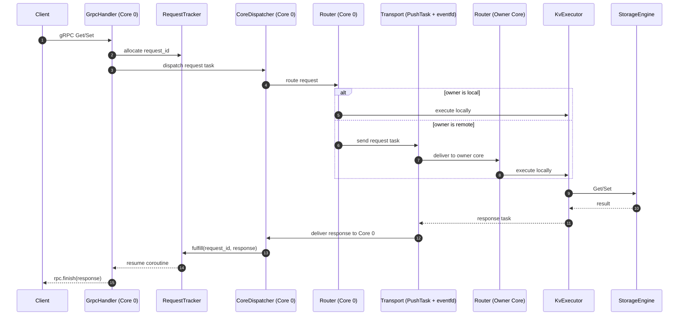

# podb

> **Статус:** рабочий прототип thread-per-core key-value engine на C++20 с gRPC ingress и hash-based routing между ядрами.

`podb` — это in-memory key-value движок, где каждый core владеет своей партицией данных, а внешний клиент разговаривает с системой по gRPC. Внутри процесса запросы не перекидываются вторым gRPC-вызовом: они превращаются во внутренний `Task`, маршрутизируются по `hash(key) % num_cores`, исполняются на owner core и возвращаются обратно как response task.

Бинарник проекта называется `db_engine`, а основные зависимости подтягиваются через `vcpkg`: `gRPC`, `Protobuf`, `asio-grpc`, `concurrentqueue`, `Boost`, `jemalloc`.

## Что умеет проект сейчас

- принимает внешние gRPC `Get` / `Set`;
- держит данные в per-core `StorageEngine`;
- маршрутизирует запрос на owner core по хэшу ключа;
- доставляет запросы между ядрами через `ConcurrentQueue + eventfd`;
- коррелирует request/response через `RequestTracker` и `request_id`.

## Быстрый старт

### 1. Зависимости

Проект ожидает `vcpkg` и toolchain-файл `scripts/buildsystems/vcpkg.cmake`. Если `VCPKG_ROOT` не выставлен, `Makefile` попробует использовать `/opt/vcpkg`.

### 2. Конфигурация

```bash
make configure
```

Эта команда:

- создаёт `build/`;
- конфигурирует CMake с `CMAKE_BUILD_TYPE=Release`;
- экспортирует `compile_commands.json`.

### 3. Сборка

```bash
make build
```

### 4. Генерация protobuf/gRPC кода

```bash
make proto
```

### 5. Docker-окружение для разработки

```bash
make docker-build
make docker-run
```

Контейнер поднимается с `--privileged`, потому что проект использует `pthread_setaffinity_np` для привязки воркеров к CPU.

## Ключевая идея архитектуры

Система разделена на слои с разными обязанностями. Это нужно не ради абстракций, а чтобы каждый этап запроса делал только одну вещь:

1. **Protocol** — принять внешний gRPC запрос и превратить его во внутренний `Task`.
2. **Async coordination** — выдать `request_id`, сохранить pending request и потом сматчить ответ с исходным RPC.
3. **Routing** — решить, на каком core должен исполняться ключ.
4. **Transport** — быстро доставить `Task` на другой core без блокировок.
5. **Execution** — локально выполнить `GET/SET` на owner core.
6. **Storage** — хранить сами данные в per-core map.
7. **Runtime** — держать event loop, очередь задач и lifecycle воркера.

Короткая формула проекта:

**Client → GrpcHandler → RequestTracker → CoreDispatcher → Router → (Transport?) → KvExecutor → StorageEngine → Transport → CoreDispatcher → RequestTracker → GrpcHandler → Client**

## Кто за что отвечает и зачем каждая часть нужна

### `src/handlers/grpc_handler.h` — `GrpcHandler`

Это входная точка внешнего протокола. Он нужен, чтобы из gRPC мира перейти во внутреннюю модель `Task` и обратно.

Что делает:

- принимает `Get` / `Set`;
- собирает `Task` типа request;
- ждёт ответ через coroutine path;
- завершает внешний `rpc.finish(...)`.

Почему он нужен отдельно: чтобы gRPC-специфика не протекала в routing, storage и межъядерный transport.

### `src/async/request_tracker.h` — `RequestTracker`

Это слой корреляции запросов. Он нужен, потому что внешний RPC и внутренний ответ разделены во времени и могут пройти через другой core.

Что делает:

- выделяет `request_id`;
- хранит pending completion handler;
- получает response task и будит нужный ожидающий запрос.

Почему он нужен отдельно: без него `GrpcHandler` пришлось бы самому держать таблицу ожиданий и связывать transport с coroutine lifecycle.

### `src/core/core_dispatcher.h` — `CoreDispatcher`

Это центральная развилка на ingress core. Он нужен, чтобы явно разделять два разных потока сообщений: новый request и уже готовый response.

Что делает:

- если приходит request task — отправляет его в `Router`;
- если приходит response task — отправляет его в `RequestTracker` / resume path.

Почему он нужен отдельно: иначе главная развилка request/response размазывается по `main.cpp`, `Worker` и handler-коду.

### `src/router/router.h` / `src/router/router.cpp` — `Router`

Это слой принятия решения, где именно должен исполняться ключ.

Что делает:

- считает `target = hash(key) % num_cores`;
- если owner локальный — запускает local execute callback;
- если owner удалённый — отправляет task через `Worker::PushTask`.

Почему он нужен отдельно: routing — это не execution и не transport. Отдельный слой делает логику владения ключом простой и детерминированной.

### `src/core/worker.h` / `src/core/worker.cpp` — `Worker`

Это runtime-слой каждого core. Он нужен, чтобы держать event loop, задачу доставки между ядрами и режим работы конкретного потока.

Что делает:

- поднимает gRPC сервер только на Core 0 (`WorkerMode::Ingress`);
- на worker-only cores крутит только локальный event loop;
- принимает внутренние `Task` через queue;
- будит event loop через `eventfd`;
- привязывает поток к CPU.

Почему он нужен отдельно: это инфраструктурный каркас, который не должен знать бизнес-смысл `GET/SET`, но должен гарантировать доставку и lifecycle core.

### `src/execution/kv_executor.h` — `KvExecutor`

Это слой локального исполнения операции.

Что делает:

- разбирает request task;
- вызывает `StorageEngine::Get/Set`;
- собирает response task с результатом.

Почему он нужен отдельно: чтобы `Router` оставался только про route decision, а логика самой операции не жила в маршрутизаторе.

### `src/storage/storage_engine.h` — `StorageEngine`

Это слой данных на конкретном core.

Что делает:

- хранит per-core `unordered_map<std::string, std::string>`;
- выполняет локальные `Get`, `Set`, `Delete`.

Почему он нужен отдельно: это минимальный и изолированный data-owner слой. Каждый core владеет своей партицией и не делит её через locks с соседями.

### `src/core/task.h` — `Task`

Это внутренний envelope сообщения между слоями.

Что делает:

- несёт request payload (`key`, `value`);
- несёт response payload (`found`, `success`, `value`);
- несёт routing metadata (`request_id`, `reply_to_core`, `type`).

Почему он нужен отдельно: это единый формат внутреннего сообщения, который понимают handler, router, executor и worker transport.

### `src/core/slab_allocator.h` — `SlabAllocator`

Это allocator для correlation slots.

Что делает:

- выдаёт идентификаторы для pending requests;
- использует generation-based slots;
- помогает избегать ABA-проблем при переиспользовании ячеек.

Почему он нужен отдельно: correlation ID должен быть быстрым и безопасным для повторного использования, а не просто случайным числом без lifecycle.

### `src/main.cpp`

Это composition root проекта.

Что делает:

- создаёт `Worker`, `Router`, `KvExecutor`, `StorageEngine`, `RequestTracker`, `CoreDispatcher`, `GrpcHandler`;
- связывает callback'и между слоями;
- поднимает startup barrier;
- запускает все core threads.

Почему он нужен отдельно: здесь должна жить только сборка графа зависимостей и runtime wiring, а не скрытая бизнес-логика.

## Полный flow одного запроса

Ниже — текущий реальный путь запроса в системе.

### Шаг 1. Клиент отправляет `Get` или `Set`

Клиент приходит в единственный внешний gRPC ingress на **Core 0**.

### Шаг 2. `GrpcHandler` переводит RPC во внутренний `Task`

`GrpcHandler` создаёт request task и передаёт его в async coordination path.

Зачем это нужно: внешний протокол отделяется от внутреннего message flow.

### Шаг 3. `RequestTracker` создаёт correlation

`RequestTracker`:

- выдаёт `request_id`;
- сохраняет pending handler;
- помечает `reply_to_core = 0`.

Зачем это нужно: ответ может вернуться позже и с другого core, поэтому системе нужен стабильный correlation key.

### Шаг 4. `CoreDispatcher` передаёт request в `Router`

Поскольку это request task, он уходит в routing path.

Зачем это нужно: ingress core должен явно различать «новый запрос» и «ответ на старый запрос».

### Шаг 5. `Router` выбирает owner core

`Router` вычисляет:

```text
owner = hash(key) % num_cores
```

Дальше два сценария:

- если owner — текущий core, задача исполняется локально;
- если owner — другой core, задача уходит через `Worker::PushTask`.

Зачем это нужно: все core независимо считают одно и то же правило владения ключом, без координации и глобальных locks.

### Шаг 6. `Worker` доставляет задачу между ядрами

Если owner удалённый, `Worker`:

- кладёт `Task` в `ConcurrentQueue` нужного core;
- будит тот core через `eventfd`.

Зачем это нужно: это дешёвый внутренний transport без второго gRPC вызова.

### Шаг 7. `KvExecutor` выполняет операцию на owner core

На owner core `KvExecutor` вызывает `StorageEngine` и собирает response task.

Зачем это нужно: только владелец партиции имеет право изменять или читать свои данные напрямую.

### Шаг 8. Response task возвращается на Core 0

После локального исполнения response task отправляется обратно на `reply_to_core`, то есть на ingress core.

Зачем это нужно: внешний gRPC coroutine живёт только там, где начался запрос.

### Шаг 9. `CoreDispatcher` и `RequestTracker` завершают ожидание

На Core 0 `CoreDispatcher` распознаёт response task и передаёт его в `RequestTracker`, который будит правильный pending handler.

Зачем это нужно: система завершает именно тот RPC, который породил этот response.

### Шаг 10. `GrpcHandler` завершает внешний RPC

Coroutine продолжает выполнение, собирает protobuf response и вызывает `rpc.finish(...)`.

Итог: клиент получает ответ, а все внутренние переходы между ядрами остаются скрыты внутри task pipeline.

## Mermaid-схема текущего flow



## Инварианты runtime

- **Единственный ingress core — Core 0.** Только он принимает внешние gRPC соединения.
- **`reply_to_core` всегда указывает на ingress core.** Ответы возвращаются туда, где живёт исходный RPC.
- **Worker-only cores не обслуживают внешний gRPC.** Они только принимают внутренние `Task` и исполняют ownership-partition.
- **Между ядрами нет второго gRPC hop.** Используется внутренний queue-based transport.
- **Один key всегда принадлежит одному owner core.** Это даёт deterministic routing.
- **Core 0 ждёт readiness остальных core перед стартом gRPC.** Иначе ingress мог бы принимать запросы раньше, чем готовы удалённые owner cores.

## Структура сборки

Верхнеуровневая сборка идёт через CMake и разбита на модули:

- `db_api` — protobuf / gRPC generated code;
- `db_core` — `Worker`, `Task`, `SlabAllocator`, `CoreDispatcher`;
- `db_async` — `RequestTracker`;
- `db_router` — `Router`;
- `db_execution` — `KvExecutor`;
- `db_storage` — `StorageEngine`;
- `db_handlers` — `GrpcHandler`;
- `db_engine` — итоговый бинарник.

Это нужно затем, чтобы зависимости были явными: transport не тянет на себя storage semantics, а protocol layer не зависит от деталей внутреннего исполнения сильнее, чем необходимо.

## Почему эта архитектура вообще имеет смысл

- **Thread-per-core** убирает shared-state contention между воркерами.
- **Hash routing** даёт простой и предсказуемый ownership rule.
- **Task envelope** позволяет всем внутренним слоям говорить на одном языке.
- **Queue + eventfd** дешевле и прозрачнее для inter-core transport, чем повторно использовать gRPC внутри процесса.
- **RequestTracker** делает async correlation явной, вместо того чтобы прятать её в ad-hoc callback'ах.
- **Разделение на Router / Executor / Storage** упрощает чтение кода: отдельно «куда отправить», отдельно «что выполнить», отдельно «где лежат данные».

## Полезные файлы для чтения дальше

- `src/main.cpp`
- `src/handlers/grpc_handler.h`
- `src/async/request_tracker.h`
- `src/core/core_dispatcher.h`
- `src/router/router.h`
- `src/core/worker.h`
- `src/execution/kv_executor.h`
- `src/storage/storage_engine.h`
- `proto/service.proto`
