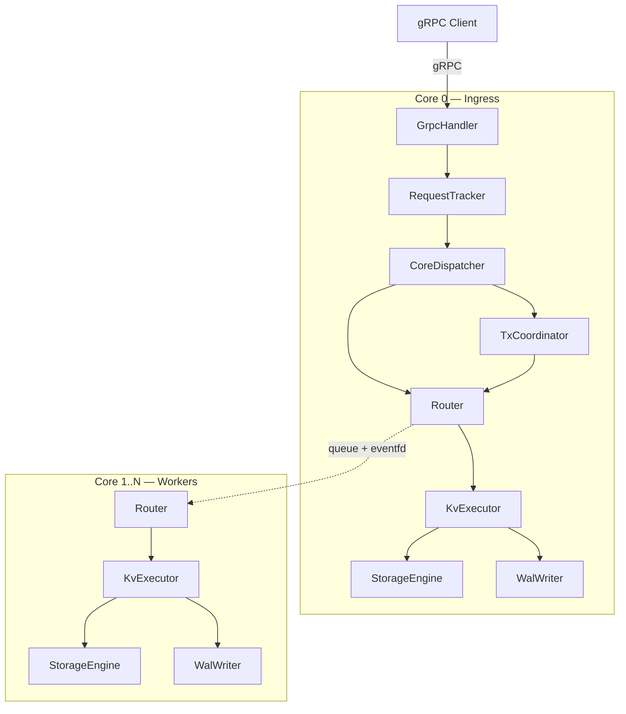

# podb

> Thread-per-core in-memory key-value engine на C++20 с MVCC, 2PC транзакциями, WAL durability и crash recovery.

`podb` — key-value движок, где каждое ядро CPU владеет своей партицией данных, а внешний клиент общается с системой по gRPC. Внутри процесса запросы не перекидываются вторым gRPC-вызовом: они превращаются во внутренний `Task`, маршрутизируются по `hash(key) % num_cores`, исполняются на owner core и возвращаются обратно как response task.

Бинарник проекта — `db_engine`. Зависимости: `gRPC`, `Protobuf`, `asio-grpc`, `concurrentqueue`, `Boost`, `jemalloc` (через `vcpkg`).

## Возможности

- **Нетранзакционные `Get` / `Set`** с hash-based routing между ядрами;
- **MVCC (Multi-Version Concurrency Control)** — version chains, snapshot isolation, write intents;
- **2PC транзакции** — Begin → Execute → Prepare → Commit/Abort через TxCoordinator;
- **Per-core WAL** — write-ahead log с CRC32c (аппаратное ускорение SSE4.2);
- **Checkpoint snapshots** — атомарная запись per-core снапшотов (write-tmp-rename-fsync);
- **Crash recovery** — восстановление из snapshot + WAL replay, разрешение in-doubt транзакций;
- **Repartitioning** — offline перераспределение данных при смене числа ядер;
- **MVCC Garbage Collection** — очистка устаревших версий по watermark;
- **Stale transaction cleanup** — reaper с lease timeout (30с) и stuck detection (10с);
- **Lock-free inter-core transport** — `ConcurrentQueue + eventfd`, drain-on-wake;
- **CPU affinity** — привязка каждого worker-потока к аппаратному ядру.

## Быстрый старт

### 1. Зависимости

Проект ожидает `vcpkg`. Если `VCPKG_ROOT` не выставлен, `Makefile` использует `/opt/vcpkg`.

### 2. Сборка и запуск

```bash
make configure    # CMake + vcpkg, экспорт compile_commands.json
make build        # Параллельная сборка
make test         # Запуск GTest-тестов (13 исполняемых)

./build/db_engine --cores 4 --port 9906 --data-dir ./data
```

### 3. Docker

```bash
make docker-build
make docker-run   # --privileged для CPU affinity
```

### 4. CLI-аргументы

| Аргумент | По умолчанию | Описание |
|----------|-------------|----------|
| `--cores` | `min(2, hw_concurrency)` | Количество ядер |
| `--port` | `9906` | TCP-порт gRPC |
| `--data-dir` | `./data` | Директория WAL и snapshots |
| `--repartition-on-recovery` | `false` | Разрешить offline repartitioning |

## Архитектура



### Слои

| Слой | Компонент | Что делает |
|------|-----------|-----------|
| Protocol | GrpcHandler | gRPC ↔ Task конвертация |
| Async | RequestTracker | Корреляция request/response |
| Dispatch | CoreDispatcher | Маршрутизация по типу задачи |
| Transaction | TxCoordinator | 2PC координация |
| Routing | Router | `hash(key) % num_cores` |
| Transport | Worker | ConcurrentQueue + eventfd |
| Execution | KvExecutor | Dispatch по TaskType |
| Storage | StorageEngine | Per-core MVCC store |
| Durability | WAL + Checkpoint | Write-ahead log + snapshots |
| Recovery | RecoveryManager | Crash recovery + repartitioning |

### Путь запроса

```
Client → GrpcHandler (Core 0)
  → RequestTracker.AllocSlot() → request_id
  → CoreDispatcher.Dispatch() → Router.RouteTask()
    → local: KvExecutor.Execute() → StorageEngine
    → remote: Worker.PushTask() → owner core → KvExecutor
  → response → Worker.PushTask() → Core 0
  → CoreDispatcher → RequestTracker.Fulfill() → GrpcHandler → Client
```

### Путь транзакции (2PC)

```
Client → BeginTransaction → TxCoordinator → tx_id + snapshot_ts
Client → Execute(tx_id, op, key, val) → Router → owner core → StorageEngine
Client → Commit(tx_id)
  → PREPARE на все participant cores → ValidatePrepare → YES/NO
  → Все YES: COMMIT_DECISION → FINALIZE_COMMIT → CommitTransaction
  → Любой NO: ABORT_DECISION → FINALIZE_ABORT → AbortTransaction
```

## Структура проекта

```
podb/
├── proto/service.proto        # gRPC API (7 RPC)
├── src/
│   ├── main.cpp               # Composition root
│   ├── api/                   # Generated protobuf/gRPC (DO NOT EDIT)
│   ├── core/                  # Worker, Task, CoreDispatcher, SlabAllocator, Clock, Types
│   ├── async/                 # RequestTracker
│   ├── router/                # Router (hash-based routing)
│   ├── execution/             # KvExecutor
│   ├── storage/               # StorageEngine (MVCC)
│   ├── handlers/              # GrpcHandler + ProtoConvert
│   ├── transaction/           # TxCoordinator (2PC)
│   ├── wal/                   # WalWriter/Reader/Record + CRC32c
│   ├── checkpoint/            # CheckpointWriter/Reader
│   └── recovery/              # RecoveryManager
├── tests/                     # 13 GTest executables
├── docs/                      # Wiki-документация по модулям
├── CMakeLists.txt             # C++20, -O3, vcpkg toolchain
├── Makefile                   # configure/build/test/proto/docker
└── vcpkg.json                 # Зависимости
```

## Инварианты

1. **Core 0** — единственный ingress (gRPC).
2. **`reply_to_core`** всегда указывает на Core 0 для внешних RPC.
3. **Между ядрами нет gRPC hop** — только queue + eventfd.
4. **Один key принадлежит ровно одному core** (deterministic hash).
5. **TxCoordinator** работает только на Core 0.
6. **2PC**: prepare all → decision → finalize all.
7. **WAL пишется до мутации** StorageEngine (write-ahead guarantee).
8. **Generation-based request ID** предотвращает ABA.
9. **Core 0 ждёт readiness** всех cores перед стартом gRPC.
10. **Graceful shutdown**: SIGINT/SIGTERM → stop workers → join threads.

## Документация

Полная wiki-документация по каждому модулю с Mermaid-диаграммами: **[docs/Home.md](docs/Home.md)**

Дизайн-решения описаны в wiki: [MVCC и транзакции](docs/Design-MVCC-Transactions.md), [Бинарные значения](docs/Design-Binary-Values.md).

## Тестирование

13 GTest-исполняемых файлов покрывают: MVCC storage, WAL, checkpoint, recovery, repartitioning, 2PC transactions, GC, stale tx cleanup.

```bash
make test
```

## Лицензия

Проект в стадии разработки.
