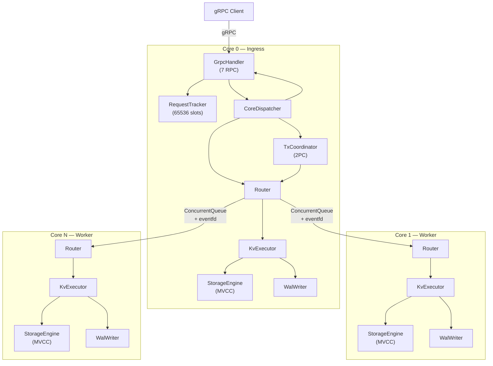

# Architecture-Overview — Обзор архитектуры

## Что это

`podb` — in-memory key-value движок на C++20 с thread-per-core моделью, MVCC, 2PC транзакциями, WAL durability и crash recovery.

## Высокоуровневая архитектура



## Слои архитектуры

| # | Слой | Компонент | Что делает |
|---|------|-----------|-----------|
| 1 | **Protocol** | [GrpcHandler](Handlers-GrpcHandler) | gRPC ↔ Task конвертация |
| 2 | **Async coordination** | [RequestTracker](Async-RequestTracker) | Корреляция request/response |
| 3 | **Dispatch** | [CoreDispatcher](Core-CoreDispatcher) | Маршрутизация по типу задачи |
| 4 | **Transaction** | [TxCoordinator](Transaction-TxCoordinator) | 2PC координация |
| 5 | **Routing** | [Router](Router) | hash(key) % num_cores |
| 6 | **Transport** | [Worker](Core-Worker) | ConcurrentQueue + eventfd |
| 7 | **Execution** | [KvExecutor](Execution-KvExecutor) | Dispatch по TaskType |
| 8 | **Storage** | [StorageEngine](Storage-StorageEngine) | Per-core MVCC store |
| 9 | **Durability** | [WAL](WAL), [Checkpoint](Checkpoint) | Write-ahead log + snapshots |
| 10 | **Recovery** | [RecoveryManager](Recovery) | Crash recovery + repartitioning |

## Ключевые принципы

### Thread-per-core

Каждое ядро CPU — отдельный поток со своим event loop, storage engine, WAL и executor. Нет shared mutable state между ядрами. Единственная точка коммуникации — lock-free очереди.

### Единственный ingress

Core 0 — единственная точка приёма внешних gRPC-запросов. Worker cores (1..N) обслуживают только внутренние задачи.

### Hash-based key ownership

```
owner = std::hash<std::string>{}(key) % num_cores
```

Детерминированное правило: все ядра вычисляют одного и того же владельца без координации.

### Task — единый envelope

Все сообщения между слоями — это [Task](Core-Task) с 22 типами операций. Единый формат упрощает routing, transport и dispatch.

## Runtime инварианты

1. Core 0 — единственный ingress. Только он принимает gRPC.
2. `reply_to_core` всегда указывает на Core 0 для внешних RPC.
3. Worker cores не обслуживают gRPC.
4. Между ядрами нет gRPC hop — только queue + eventfd.
5. Один key принадлежит ровно одному core.
6. Core 0 ждёт readiness всех cores перед стартом gRPC.
7. TxCoordinator работает только на Core 0.
8. 2PC: prepare all → decision → finalize all.
9. WAL пишется до мутации StorageEngine.
10. Generation-based request ID предотвращает ABA.

## Composition Root (`main.cpp`)

Вся сборка зависимостей происходит в `main.cpp` (252 строки):

```
Parse CLI → Create dirs → Topology check → Recovery/Repartition
→ Create StorageEngine × N → Create WalWriter × N → Create Worker × N
→ Create KvExecutor × N → Create Router × N
→ Deferred pointer pattern (GrpcHandler ↔ CoreDispatcher)
→ Create GrpcHandler → Create TxCoordinator → Create CoreDispatcher
→ Wire task_processors → Start workers → Readiness barrier
→ Resolve in-doubt transactions → Start reaper timer → Run Core 0
```

**Deferred pointer pattern**: GrpcHandler и CoreDispatcher имеют циклическую зависимость. Разрешается через захват указателя в lambda, который присваивается после создания обоих объектов.

## Модули документации

### Core
- [Core-Task](Core-Task) — envelope сообщений
- [Core-Worker](Core-Worker) — runtime ядра
- [Core-CoreDispatcher](Core-CoreDispatcher) — диспетчер Core 0
- [Core-SlabAllocator](Core-SlabAllocator) — аллокатор слотов
- [Core-Clock](Core-Clock) — абстракция времени
- [Core-Types](Core-Types) — BinaryValue

### Модули данных
- [Storage-StorageEngine](Storage-StorageEngine) — MVCC-хранилище
- [Execution-KvExecutor](Execution-KvExecutor) — исполнитель операций
- [Router](Router) — маршрутизация

### Протокол и async
- [Handlers-GrpcHandler](Handlers-GrpcHandler) — gRPC обработчики
- [Async-RequestTracker](Async-RequestTracker) — корреляция запросов

### Транзакции
- [Transaction-TxCoordinator](Transaction-TxCoordinator) — 2PC координатор

### Durability
- [WAL](WAL) — write-ahead log
- [Checkpoint](Checkpoint) — snapshots
- [Recovery](Recovery) — crash recovery

### Reference
- [gRPC-API](gRPC-API) — справочник API
- [Build-Deploy](Build-Deploy) — сборка и запуск

### Дизайн-решения
- [Design-MVCC-Transactions](Design-MVCC-Transactions) — дизайн транзакционной модели
- [Design-Binary-Values](Design-Binary-Values) — дизайн бинарных значений
