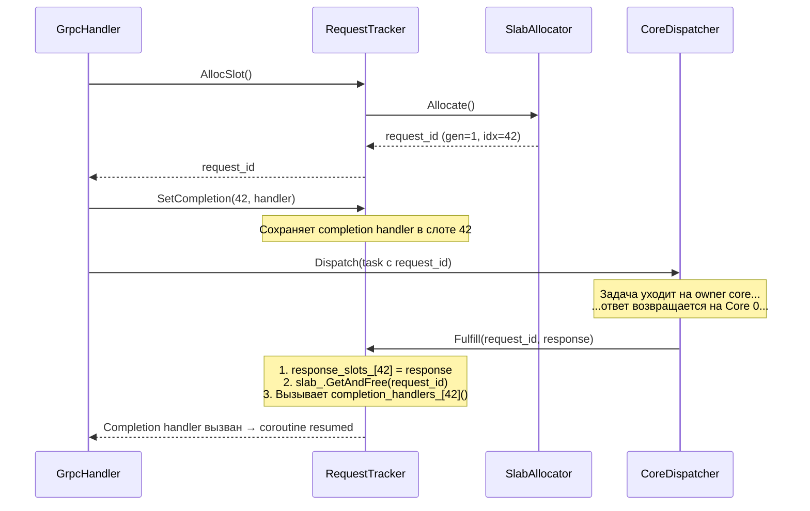

# Async-RequestTracker — Корреляция запросов

## Что это

`RequestTracker` (`src/async/request_tracker.h`) — слой корреляции request/response. Связывает входящий gRPC-запрос с внутренним ответом, который может прийти позже и с другого ядра.

## Зачем нужно

В thread-per-core архитектуре запрос и ответ разделены во времени и пространстве:

1. gRPC-запрос приходит на Core 0;
2. Задача маршрутизируется на owner core (может быть Core 3);
3. Ответ возвращается на Core 0 через очередь;
4. Нужно сопоставить ответ с ожидающим coroutine.

Без `RequestTracker` `GrpcHandler` пришлось бы самостоятельно управлять таблицей ожиданий и связывать transport с coroutine lifecycle.

## Как работает

### Полный lifecycle



### Формат request_id

```
request_id = (generation << 32) | index

Биты:  [63..32] generation    [31..0] index
Пример: 0x00000001_0000002A = generation 1, index 42
```

### ABA-защита

Если запоздалый ответ приходит с устаревшим `request_id`:

```
1. Fulfill(old_request_id) вызывает slab_.GetAndFree()
2. GetAndFree() извлекает generation из request_id
3. Сравнивает с текущей generation слота
4. Не совпадает → молча игнорирует (слот уже переиспользован)
```

Это предотвращает ошибочное возобновление чужого coroutine.

## Публичный API

```cpp
class RequestTracker {
public:
    explicit RequestTracker(size_t capacity = 65536);
    // Создаёт tracker с capacity слотов.

    uint64_t AllocSlot();
    // Выделяет слот, возвращает request_id = (generation << 32) | index.

    void SetCompletion(uint32_t index, std::function<void()> handler);
    // Сохраняет completion handler для слота index.
    // Вызывается GrpcHandler после AllocSlot().

    Task GetResponse(uint32_t index);
    // Возвращает std::move(response_slots_[index]).
    // Вызывается из completion handler.

    void Fulfill(uint64_t request_id, Task response);
    // 1. Сохраняет response в response_slots_[index]
    // 2. Освобождает слот через slab_.GetAndFree()
    // 3. Вызывает и очищает completion handler
};
```

### Внутренние данные

```cpp
SlabAllocator slab_;                                      // Generation-based аллокатор
std::vector<Task> response_slots_;                         // Хранение ответов (65536)
std::vector<std::function<void()>> completion_handlers_;  // Callbacks (65536)
```

## Связи с другими модулями

| Модуль | Взаимодействие |
|--------|---------------|
| [Core-SlabAllocator](Core-SlabAllocator) | Внутренний компонент для выдачи/освобождения request_id |
| [Handlers-GrpcHandler](Handlers-GrpcHandler) | Владеет `RequestTracker`; вызывает `AllocSlot()`, `SetCompletion()` |
| [Core-CoreDispatcher](Core-CoreDispatcher) | Вызывает `GrpcHandler::ResumeCoroutine()` → `Fulfill()` |

## См. также

- [Core-SlabAllocator](Core-SlabAllocator) — generation-based аллокация слотов
- [Handlers-GrpcHandler](Handlers-GrpcHandler) — `async_initiate` паттерн, использующий RequestTracker
- [Request-Flow](Request-Flow) — полный путь request_id через систему
