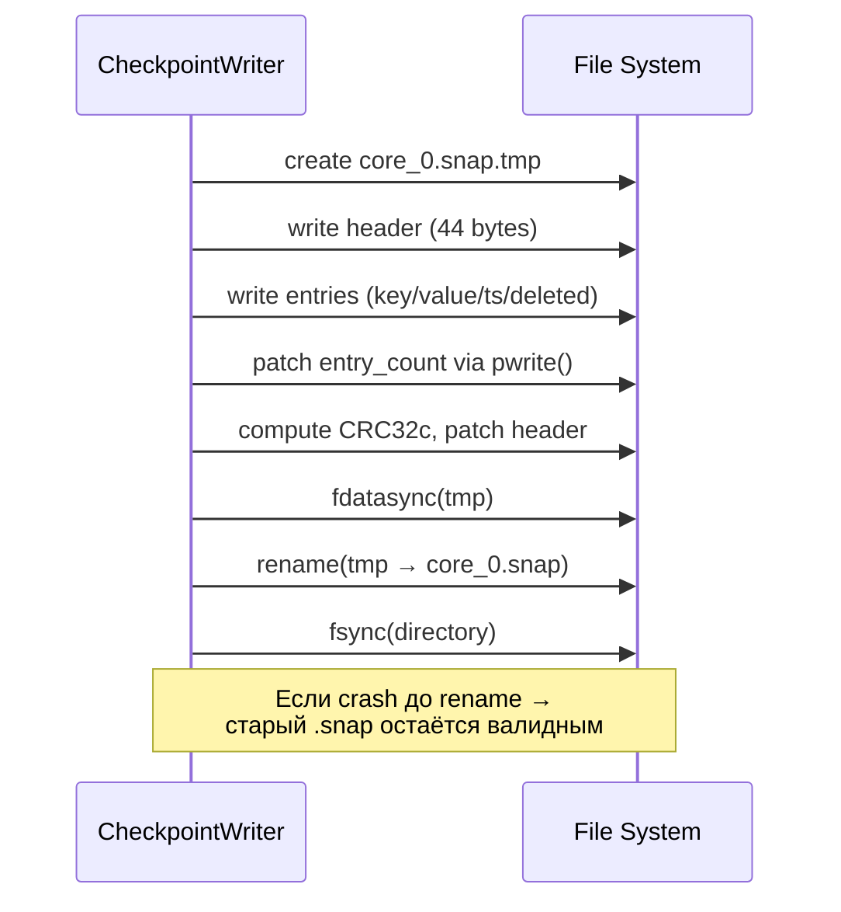

# Checkpoint — Снапшоты данных

## Что это

Модуль `src/checkpoint/` реализует атомарное сохранение и загрузку per-core снапшотов MVCC-хранилища. Снапшот — сериализованное committed-состояние `StorageEngine` на определённый WAL LSN.

## Зачем нужно

Без снапшотов recovery при каждом запуске воспроизводил бы весь WAL с самого начала. С снапшотами:

```
загрузить snapshot → replay только WAL-хвоста после snapshot LSN
```

Это критично для production-систем с большим объёмом данных и длинной WAL-историей.

## Как работает

### Атомарная запись (write-tmp-rename-fsync)



Гарантии:
- **Partial write safety**: данные пишутся в `.tmp`, основной файл не трогается до финального `rename`;
- **fdatasync()**: все данные на диске до `rename`;
- **fsync(dir)**: сам `rename` durably зафиксирован;
- **Crash safety**: при crash во время записи `.tmp` — orphaned; при crash во время rename — старый файл валиден.

### Формат заголовка (44 байта)

```
Offset  Size    Поле           Описание
[0-3]   4B      magic          0xDB534E50 (идентификатор формата)
[4-7]   4B      version        1 (версия формата)
[8-11]  4B      core_id        ID ядра, которому принадлежит snapshot
[12-15] 4B      num_cores      Количество ядер в текущей топологии
[16-23] 8B      layout_epoch   Эпоха топологии (инкрементируется при repartition)
[24-31] 8B      wal_lsn        WAL LSN, до которого snapshot валиден
[32-39] 8B      entry_count    Количество committed-записей
[40-43] 4B      crc32c         Masked CRC32c заголовка
```

### Формат записей

После заголовка идут `entry_count` записей подряд:

```
Поле        Размер              Описание
key_sz      4B (uint32_t)       Длина ключа
key         key_sz bytes        Ключ
val_sz      4B (uint32_t)       Длина значения
value       val_sz bytes        Значение (BinaryValue)
commit_ts   8B (uint64_t)       Timestamp коммита
is_deleted  1B (uint8_t)        0 = live, 1 = tombstone
```

### Метаданные топологии

Заголовок содержит `num_cores` и `layout_epoch` — они используются при recovery для:
- **валидации совместимости**: если `num_cores` изменилось, нужен repartition;
- **обнаружения устаревших snapshot'ов**: `layout_epoch` меняется при каждом repartition.

```cpp
struct TopologyMeta {
    uint32_t num_cores;      // Количество ядер
    uint64_t layout_epoch;   // Эпоха layout'а
};
```

## Публичный API

### `CheckpointWriter`

```cpp
class CheckpointWriter {
public:
    static void Write(const StorageEngine& storage,
                      const std::string& path,
                      int core_id,
                      const TopologyMeta& topo,
                      uint64_t wal_lsn);
    // Атомарно записывает snapshot всех committed-версий из storage в path.
    // Использует write-tmp-rename-fsync паттерн.
    // Throws std::runtime_error при ошибке I/O.
};
```

### `CheckpointReader`

```cpp
struct SnapshotHeader {
    uint32_t core_id;        // ID ядра
    uint32_t num_cores;      // Топология: количество ядер
    uint64_t layout_epoch;   // Топология: эпоха
    uint64_t wal_lsn;        // WAL LSN до которого snapshot валиден
    uint64_t entry_count;    // Количество записей
};

class CheckpointReader {
public:
    static std::optional<SnapshotHeader> ReadHeader(const std::string& path);
    // Читает и валидирует только заголовок (44 байта).
    // Возвращает nullopt если файл не существует, magic не совпадает,
    // или CRC невалидный.

    static SnapshotHeader Load(const std::string& path, StorageEngine& storage);
    // Загружает полный snapshot в StorageEngine.
    // Для каждой записи вызывает storage.RestoreCommitted().
    // Throws std::runtime_error при ошибке.
};
```

## Связи с другими модулями

| Модуль | Взаимодействие |
|--------|---------------|
| [Storage-StorageEngine](Storage-StorageEngine) | `ForEachLatestCommitted()` — итерация committed данных при записи; `RestoreCommitted()` — восстановление при загрузке |
| [WAL](WAL) | `wal_lsn` в заголовке определяет, с какого LSN начинать WAL replay после загрузки snapshot |
| [Recovery](Recovery) | `RecoverCore()` загружает snapshot, затем replay'ит WAL хвост |
| [CRC32c](WAL) | Используется для целостности заголовка |

## См. также

- [Recovery](Recovery) — как snapshot используется в процессе восстановления
- [WAL](WAL) — WAL-файлы, которые replay'ятся поверх snapshot
- [Storage-StorageEngine](Storage-StorageEngine) — MVCC-хранилище, которое сериализуется/восстанавливается
