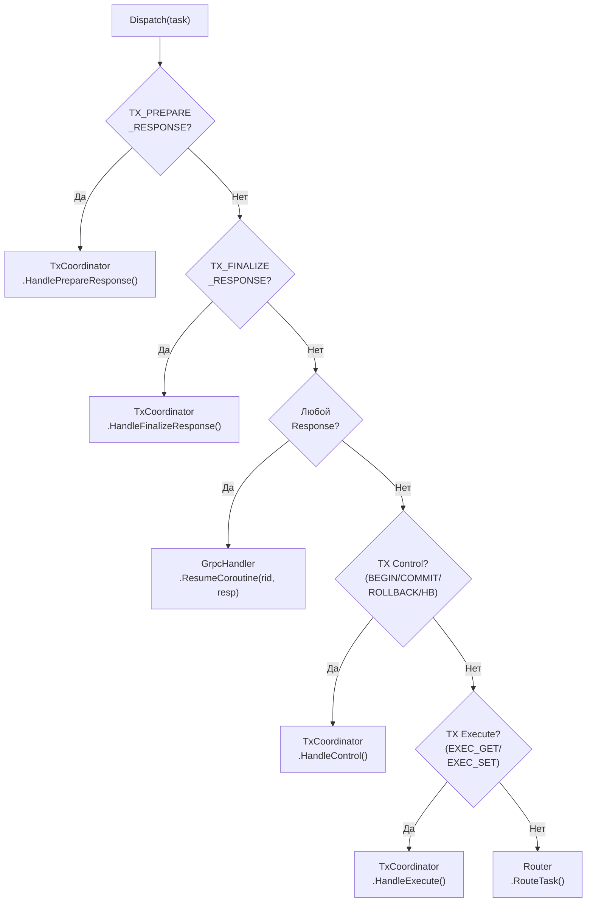

# Core-CoreDispatcher — Центральный диспетчер Core 0

## Что это

`CoreDispatcher` (`src/core/core_dispatcher.h`) — центральная развилка на ingress core (Core 0). Маршрутизирует входящие задачи к нужному обработчику по типу: requests → Router, responses → GrpcHandler, tx control → TxCoordinator.

## Зачем нужно

На Core 0 сходятся два потока:
- **Новые запросы** от GrpcHandler → нужно маршрутизировать через Router;
- **Ответы** от worker cores → нужно вернуть в GrpcHandler;
- **TX-управление** — Begin/Commit/Rollback/Heartbeat → TxCoordinator;
- **2PC responses** — Prepare/Finalize ответы → TxCoordinator.

Без CoreDispatcher эта развилка размазалась бы по `main.cpp`, `Worker` и handler-коду.

## Как работает

### Диспетчеризация (6 веток)



### Приоритет проверок

1. **TX_PREPARE_RESPONSE** → TxCoordinator (2PC голосование);
2. **TX_FINALIZE_*_RESPONSE** → TxCoordinator (2PC финализация);
3. **Любой *_RESPONSE** → GrpcHandler (возобновление coroutine);
4. **TX Control** → TxCoordinator (управление транзакцией);
5. **TX Execute** → TxCoordinator (маршрутизация через координатор);
6. **Default (GET/SET)** → Router (стандартная маршрутизация).

Responses проверяются **раньше** requests — ожидающие RPC должны быть возобновлены как можно быстрее.

## Публичный API

```cpp
class CoreDispatcher {
public:
    CoreDispatcher(Router& router,
                   GrpcHandler& handler,
                   TxCoordinator& tx_coordinator);

    void Dispatch(Task task);
    // Маршрутизирует задачу к нужному обработчику по типу.
};
```

## Связи с другими модулями

| Модуль | Взаимодействие |
|--------|---------------|
| [Core-Worker](Core-Worker) | `task_processor` на Core 0 = `dispatcher.Dispatch` |
| [Router](Router) | Получает non-tx request задачи |
| [Handlers-GrpcHandler](Handlers-GrpcHandler) | Получает response задачи для возобновления coroutine |
| [Transaction-TxCoordinator](Transaction-TxCoordinator) | Получает TX control, execute, prepare/finalize responses |

## См. также

- [Architecture-Overview](Architecture-Overview) — роль CoreDispatcher в общей архитектуре
- [Request-Flow](Request-Flow) — путь задачи через CoreDispatcher
- [Transaction-Flow](Transaction-Flow) — TX-задачи через CoreDispatcher
