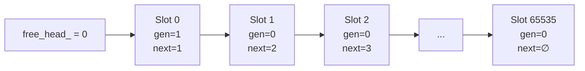

# Core-SlabAllocator — Аллокатор корреляционных слотов

## Что это

`SlabAllocator` (`src/core/slab_allocator.h`) — generation-based аллокатор слотов для request ID. Обеспечивает быструю и безопасную выдачу/переиспользование идентификаторов, предотвращая ABA-проблемы.

## Зачем нужно

Каждый входящий gRPC-запрос получает `request_id`, который живёт в системе до момента прихода ответа. Когда ответ обработан, слот освобождается и может быть переиспользован для нового запроса.

### Проблема ABA

Без generation-механизма возможна ситуация:

1. Запрос A получает `request_id = 42`;
2. Ответ на A приходит, слот 42 освобождается;
3. Запрос B получает тот же `request_id = 42`;
4. Запоздалый дубликат ответа A приходит с `request_id = 42`;
5. **Дубликат ошибочно обрабатывается как ответ на B** — ABA-проблема.

### Решение: generation counter

`SlabAllocator` кодирует `request_id` как:

```
request_id = (generation << 32) | index
```

При каждом освобождении слота `generation` инкрементируется. Запоздалый ответ с устаревшей generation будет молча проигнорирован.

## Как работает

### Структура слота

```cpp
struct alignas(8) Slot {
    uint32_t next_free_index;  // Следующий свободный слот в free-list
    uint32_t generation;       // Счётчик поколений (инкрементируется при каждом free)
};
```

### Free-list

Слоты организованы в intrusive linked list:



### Жизненный цикл

```
1. Allocate()
   - Берём слот с головы free-list
   - Возвращаем request_id = (slots_[head].generation << 32) | head
   - Сдвигаем head на next_free_index

2. GetAndFree(request_id)
   - Извлекаем index = request_id & 0xFFFFFFFF
   - Извлекаем generation = request_id >> 32
   - Проверяем: generation == slots_[index].generation?
     - Да → инкрементируем generation, возвращаем слот в free-list
     - Нет → stale ID, молча игнорируем (ABA-защита)
```

### Пример ABA-защиты

```
Шаг 1: Allocate() → request_id = 0x00000001_00000042 (gen=1, idx=66)
Шаг 2: GetAndFree(0x00000001_00000042) → gen совпадает, слот освобождён, gen → 2
Шаг 3: Allocate() → request_id = 0x00000002_00000042 (gen=2, idx=66)
Шаг 4: Запоздалый GetAndFree(0x00000001_00000042) → gen=1 ≠ slots_[66].gen=2 → IGNORED
```

## Публичный API

```cpp
class SlabAllocator {
public:
    explicit SlabAllocator(size_t capacity = 65536);
    // Создаёт аллокатор с capacity слотов (по умолчанию 65536).
    // Инициализирует free-list: каждый слот указывает на следующий.

    uint64_t Allocate();
    // Выделяет слот, возвращает request_id = (generation << 32) | index.
    // Throws std::runtime_error если все слоты заняты.

    void GetAndFree(uint64_t request_id);
    // Освобождает слот, если generation совпадает.
    // Если generation не совпадает (stale ID) — молча игнорирует.
    // Инкрементирует generation при освобождении.
};
```

### Константы

| Константа | Значение | Описание |
|-----------|----------|----------|
| Capacity по умолчанию | 65536 | Макс. одновременных pending requests |
| Generation | 32 бита | Обнуляется после 2³² переиспользований одного слота |
| Index | 32 бита | 0—65535 |
| `alignas(8)` на Slot | 8 байт | Выравнивание для потенциальных атомарных операций |

## Связи с другими модулями

| Модуль | Как использует |
|--------|---------------|
| [Async-RequestTracker](Async-RequestTracker) | Владеет `SlabAllocator` для выдачи/освобождения `request_id` |
| [Handlers-GrpcHandler](Handlers-GrpcHandler) | Через `RequestTracker` получает `request_id` для каждого RPC |

## См. также

- [Async-RequestTracker](Async-RequestTracker) — основной потребитель `SlabAllocator`
- [Handlers-GrpcHandler](Handlers-GrpcHandler) — жизненный цикл `request_id` в контексте RPC
- [Request-Flow](Request-Flow) — полный путь request_id через систему
