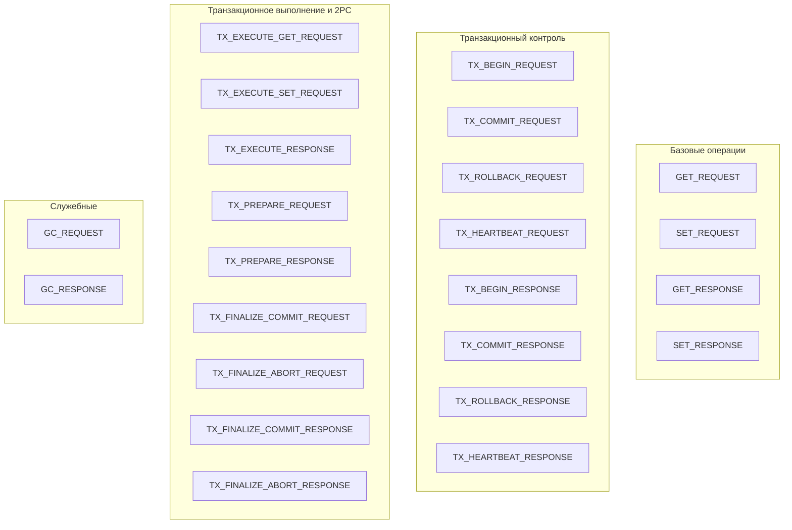

# Core-Task — Внутренний envelope сообщений

## Что это

`Task` (`src/core/task.h`) — универсальный формат внутреннего сообщения, который проходит через все слои системы. Каждый запрос, ответ, транзакционная команда и служебная операция представлены как `Task`.

## Зачем нужно

В thread-per-core архитектуре запрос проходит через множество компонентов: GrpcHandler → CoreDispatcher → Router → Worker transport → KvExecutor → StorageEngine и обратно. Единый формат сообщения позволяет:

- **всем слоям говорить на одном языке** — нет необходимости конвертировать между разными типами;
- **маршрутизировать по `type`** — CoreDispatcher, Router и KvExecutor используют `TaskType` для dispatch;
- **корреляция request/response** — через поле `request_id`;
- **адресация ответа** — через поле `reply_to_core`.

## Как работает

### Enum `TaskType`

Все типы задач организованы в три группы:



### Полная таблица `TaskType`

| Тип | Категория | Направление | Обработчик |
|-----|-----------|-------------|------------|
| `GET_REQUEST` | Базовые | Request | Router → KvExecutor |
| `SET_REQUEST` | Базовые | Request | Router → KvExecutor |
| `GET_RESPONSE` | Базовые | Response | CoreDispatcher → GrpcHandler |
| `SET_RESPONSE` | Базовые | Response | CoreDispatcher → GrpcHandler |
| `TX_BEGIN_REQUEST` | Tx Control | Request | TxCoordinator |
| `TX_COMMIT_REQUEST` | Tx Control | Request | TxCoordinator |
| `TX_ROLLBACK_REQUEST` | Tx Control | Request | TxCoordinator |
| `TX_HEARTBEAT_REQUEST` | Tx Control | Request | TxCoordinator |
| `TX_BEGIN_RESPONSE` | Tx Control | Response | CoreDispatcher → GrpcHandler |
| `TX_COMMIT_RESPONSE` | Tx Control | Response | CoreDispatcher → GrpcHandler |
| `TX_ROLLBACK_RESPONSE` | Tx Control | Response | CoreDispatcher → GrpcHandler |
| `TX_HEARTBEAT_RESPONSE` | Tx Control | Response | CoreDispatcher → GrpcHandler |
| `TX_EXECUTE_GET_REQUEST` | Tx Execute | Request | TxCoordinator → Router → KvExecutor |
| `TX_EXECUTE_SET_REQUEST` | Tx Execute | Request | TxCoordinator → Router → KvExecutor |
| `TX_EXECUTE_RESPONSE` | Tx Execute | Response | TxCoordinator → GrpcHandler |
| `TX_PREPARE_REQUEST` | 2PC | Request | Router → KvExecutor (direct-to-core) |
| `TX_PREPARE_RESPONSE` | 2PC | Response | CoreDispatcher → TxCoordinator |
| `TX_FINALIZE_COMMIT_REQUEST` | 2PC | Request | Router → KvExecutor (direct-to-core) |
| `TX_FINALIZE_ABORT_REQUEST` | 2PC | Request | Router → KvExecutor (direct-to-core) |
| `TX_FINALIZE_COMMIT_RESPONSE` | 2PC | Response | CoreDispatcher → TxCoordinator |
| `TX_FINALIZE_ABORT_RESPONSE` | 2PC | Response | CoreDispatcher → TxCoordinator |
| `GC_REQUEST` | Служебные | Request | Router → KvExecutor (всегда локально) |
| `GC_RESPONSE` | Служебные | Response | (не обрабатывается) |

### Структура `Task`

```cpp
struct Task {
    // --- Тип операции ---
    TaskType type = TaskType::GET_REQUEST;

    // --- Request payload ---
    std::string key;          // Ключ для GET/SET (routing по hash(key))
    BinaryValue value;        // Значение для SET (бинарные данные)

    // --- Response payload ---
    bool found = false;       // GET: найден ли ключ
    bool success = true;      // Успешна ли операция

    // --- Routing и корреляция ---
    uint64_t request_id = 0;  // ID для корреляции request ↔ response
    int reply_to_core = -1;   // Куда отправить ответ (всегда Core 0 для внешних RPC)

    // --- Транзакционные поля ---
    uint64_t tx_id = 0;       // ID транзакции (0 = нет транзакции)
    uint64_t snapshot_ts = 0; // Snapshot timestamp для Snapshot Isolation
    uint64_t commit_ts = 0;   // Commit timestamp для finalize-операций

    // --- Ошибки ---
    std::string error_message; // Детали ошибки (пустая = нет ошибки)
};
```

### Helper-методы

```cpp
bool IsRequest() const noexcept;      // true для всех *_REQUEST типов
bool IsResponse() const noexcept;     // true для всех *_RESPONSE типов
bool IsTxControl() const noexcept;    // BEGIN/COMMIT/ROLLBACK/HEARTBEAT — обрабатывает TxCoordinator
bool IsTxExecute() const noexcept;    // TX_EXECUTE_GET/SET/RESPONSE — маршрутизируется через TxCoordinator
bool IsTxFinalize() const noexcept;   // TX_FINALIZE_COMMIT/ABORT_REQUEST — direct-to-core
bool IsTxPrepare() const noexcept;    // TX_PREPARE_REQUEST — direct-to-core
bool IsTxPrepareResponse() const noexcept;    // TX_PREPARE_RESPONSE
bool IsTxFinalizeResponse() const noexcept;   // TX_FINALIZE_*_RESPONSE
const char* OpName() const noexcept;  // Человекочитаемое имя ("GET", "SET", "BEGIN", ...)
```

### Функция `TaskTypeName`

```cpp
const char* TaskTypeName(TaskType t) noexcept;
// Возвращает 4-символьное имя для логирования: "GET ", "SET←", "TXBG", и т.д.
```

## Публичный API

Полный API описан выше в разделе "Структура Task" и "Helper-методы".

Ключевые поля для каждого сценария:

| Сценарий | Ключевые поля |
|----------|---------------|
| Non-tx GET | `type`, `key`, `request_id`, `reply_to_core` |
| Non-tx SET | `type`, `key`, `value`, `request_id`, `reply_to_core` |
| Tx Execute | `type`, `key`, `value`, `tx_id`, `snapshot_ts`, `request_id`, `reply_to_core` |
| Tx Prepare | `type`, `tx_id`, `reply_to_core` |
| Tx Finalize | `type`, `tx_id`, `commit_ts`, `reply_to_core` |
| GC | `type`, `snapshot_ts` (используется как watermark) |

## Связи с другими модулями

`Task` — это центральный тип, который используют **все** модули:

| Модуль | Как использует Task |
|--------|-------------------|
| [Handlers-GrpcHandler](Handlers-GrpcHandler) | Создаёт request Task из protobuf, получает response Task |
| [Async-RequestTracker](Async-RequestTracker) | Хранит pending Task responses, индексирует по request_id |
| [Core-CoreDispatcher](Core-CoreDispatcher) | Маршрутизирует Task по типу (request/response/tx) |
| [Router](Router) | Вычисляет owner core по `task.key` |
| [Core-Worker](Core-Worker) | Транспортирует Task между ядрами через ConcurrentQueue |
| [Execution-KvExecutor](Execution-KvExecutor) | Dispatch по `task.type`, выполнение на owner core |
| [Transaction-TxCoordinator](Transaction-TxCoordinator) | Обработка TX_* типов, 2PC координация |

## См. также

- [Core-Types](Core-Types) — определение `BinaryValue`, используемого в `Task::value`
- [Core-CoreDispatcher](Core-CoreDispatcher) — маршрутизация Task по типу на Core 0
- [Execution-KvExecutor](Execution-KvExecutor) — dispatch и выполнение Task на owner core
- [Architecture-Overview](Architecture-Overview) — общая архитектура и flow сообщений
