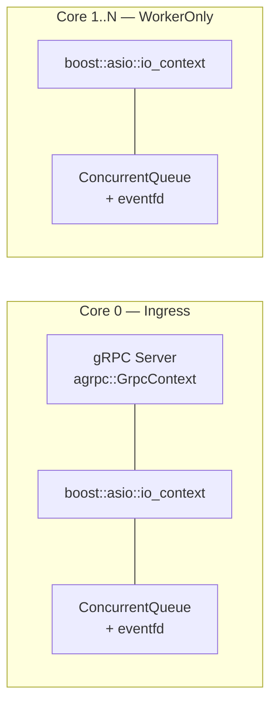
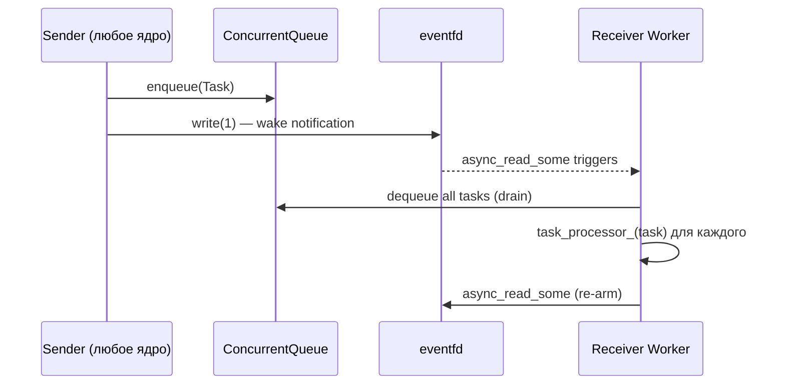

# Core-Worker — Runtime ядра

## Что это

`Worker` (`src/core/worker.h`) — runtime-инфраструктура для каждого ядра. Управляет event loop, gRPC-сервером (только Core 0), задачной очередью и привязкой к CPU.

## Зачем нужно

Thread-per-core модель требует, чтобы каждый поток:
- крутил собственный event loop (нет общего thread pool);
- был привязан к конкретному CPU (`pthread_setaffinity_np`);
- принимал задачи от других ядер без блокировок;
- Core 0 дополнительно обслуживал внешний gRPC.

`Worker` инкапсулирует всё это, не зная бизнес-логики GET/SET/TX.

## Как работает

### Два режима работы



| Режим | Ядро | gRPC | Event Loop | Task Queue |
|-------|------|------|-----------|------------|
| `Ingress` | Core 0 | Да | `io_context` + `grpc_context` | Да (для ответов) |
| `WorkerOnly` | 1..N | Нет | Только `io_context` | Да (для запросов) |

### Inter-core transport: ConcurrentQueue + eventfd



- **ConcurrentQueue** (`moodycamel::ConcurrentQueue`) — lock-free очередь, wait-free push;
- **eventfd** — ядерный примитив для wake-up (`EFD_NONBLOCK | EFD_SEMAPHORE`);
- **Drain-on-wake** — при пробуждении worker вычитывает **все** задачи из очереди, не по одной;
- **stream_descriptor** — обёртка boost::asio для интеграции eventfd в event loop.

### CPU Affinity

```cpp
void SetCpuAffinity() {
    cpu_set_t cpuset;
    CPU_ZERO(&cpuset);
    CPU_SET(core_id_, &cpuset);
    pthread_setaffinity_np(pthread_self(), sizeof(cpu_set_t), &cpuset);
}
```

- Привязывает поток к конкретному аппаратному ядру;
- Уменьшает context switches и улучшает cache locality;
- Требует `--privileged` в Docker (или `CAP_SYS_NICE`).

### Cache-line alignment

```cpp
class alignas(64) Worker { ... };
```

`alignas(64)` предотвращает false sharing — объекты Worker разных ядер не попадают в одну cache line.

### Startup barrier

Барьер готовности гарантирует, что gRPC-сервер не начнёт принимать запросы до того, как все worker-ядра будут готовы:

```
main():
  workers[1..N]->Start()       // запуск потоков
  for each worker:
    while(!worker->IsReady())  // spin-wait на atomic<bool>
      yield()
  workers[0]->StartSync()     // запуск Core 0 (gRPC)
```

## Публичный API

### Конструктор и lifecycle

```cpp
Worker(int core_id, WorkerMode mode, int port);
~Worker();              // Останавливает event loop, закрывает eventfd

void Start();           // Запускает worker в отдельном потоке
void StartSync();       // Запускает event loop в текущем потоке (для Core 0)
void Stop();            // Сигнализирует остановку, shutdown gRPC
void Join();            // Ожидает завершения потока
bool IsReady() const;   // atomic: true когда event loop запущен
```

### gRPC (только Ingress)

```cpp
void RegisterGrpcService(grpc::Service* service);
    // Регистрирует gRPC-сервис (no-op на WorkerOnly)

void AddStartupTask(std::function<void()> task);
    // Задача инициализации после старта gRPC (no-op на WorkerOnly)

agrpc::GrpcContext& GetGrpcContext();
    // gRPC context для async операций (assert на WorkerOnly)

boost::asio::io_context& GetIoContext();
    // Event loop context (доступен на обоих режимах)
```

### Task transport

```cpp
void SetTaskProcessor(std::function<void(Task)> processor);
    // Устанавливает callback обработки входящих задач.
    // Core 0: processor = CoreDispatcher::Dispatch
    // Cores 1..N: processor = Router::RouteTask

void PushTask(Task task);
    // Помещает задачу в очередь и будит worker через eventfd.
    // Thread-safe, lock-free, вызывается с любого ядра.
```

## Связи с другими модулями

| Модуль | Взаимодействие |
|--------|---------------|
| `main.cpp` | Создаёт Worker для каждого ядра, настраивает task_processor |
| [Router](Router) | Вызывает `PushTask()` для отправки задачи на удалённое ядро |
| [Execution-KvExecutor](Execution-KvExecutor) | Через callback вызывает `PushTask()` для отправки ответа обратно |
| [Handlers-GrpcHandler](Handlers-GrpcHandler) | Регистрируется через `RegisterGrpcService()` и `AddStartupTask()` |
| [Core-CoreDispatcher](Core-CoreDispatcher) | Устанавливается как `task_processor` на Core 0 |

## См. также

- [Architecture-Overview](Architecture-Overview) — роль Worker в общей архитектуре
- [Router](Router) — маршрутизация задач между ядрами через Worker
- [Core-CoreDispatcher](Core-CoreDispatcher) — обработка задач на Core 0
- [Build-Deploy](Build-Deploy) — `--privileged` для CPU affinity в Docker
