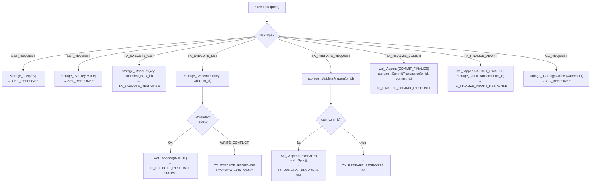

# Execution-KvExecutor — Исполнитель операций

## Что это

`KvExecutor` (`src/execution/kv_executor.h`) — слой локального выполнения операций на owner core. Принимает Task, dispatch'ит по типу, вызывает StorageEngine и WAL, формирует response Task.

## Зачем нужно

Разделение между Router (куда отправить) и KvExecutor (что выполнить) делает каждый слой простым:
- Router не знает логику GET/SET/TX;
- KvExecutor не знает о маршрутизации и transport;
- StorageEngine не знает о Task'ах и WAL.

KvExecutor — это тонкий dispatch-слой, связывающий Task, StorageEngine и WAL.

## Как работает

### Dispatch по TaskType



### Write-ahead guarantee

Для каждой мутации WAL-запись создаётся **до** изменения StorageEngine:

| Операция | WAL-запись | Sync? | Затем StorageEngine |
|----------|-----------|-------|---------------------|
| TX_EXECUTE_SET | INTENT | Нет | WriteIntent() |
| TX_PREPARE (YES) | PREPARE | **Да** (`fdatasync`) | — |
| TX_FINALIZE_COMMIT | COMMIT_FINALIZE | Нет | CommitTransaction() |
| TX_FINALIZE_ABORT | ABORT_FINALIZE | Нет | AbortTransaction() |

`Sync()` вызывается **только при PREPARE** — это гарантирует, что все INTENT записи и сам PREPARE durably на диске перед отправкой YES-vote.

### Формирование response

Каждый response Task наследует из request:
- `request_id` — для корреляции с ожидающим coroutine;
- `reply_to_core` — куда отправить ответ (всегда Core 0);
- `key` — echo обратно;
- `tx_id` — для транзакционных операций.

## Публичный API

```cpp
class KvExecutor {
public:
    KvExecutor(StorageEngine& storage, int core_id, WalWriter* wal = nullptr);
    // storage: ссылка на per-core StorageEngine (non-owning)
    // core_id: ID ядра (для логирования)
    // wal: опциональный WAL writer (nullptr = без durability)

    Task Execute(Task request);
    // Dispatch по request.type → вызов StorageEngine/WAL → response Task
};
```

### Логирование

```
[Core 2] EXEC SET "user:1" size=64 → OK reply→Core 0
[Core 1] EXEC GET "user:1" → FOUND reply→Core 0
[Core 3] EXEC TX_SET "key" tx=5 → OK reply→Core 0
[Core 3] EXEC TX_SET "key" tx=7 → CONFLICT reply→Core 0
[Core 1] EXEC PREPARE tx=5 → YES
[Core 1] EXEC FIN_COMMIT tx=5 commit_ts=150
[Core 2] GC watermark=100 removed=3
```

## Связи с другими модулями

| Модуль | Взаимодействие |
|--------|---------------|
| [Storage-StorageEngine](Storage-StorageEngine) | Вызывает все CRUD и MVCC-методы |
| [WAL](WAL) | `Append()` для INTENT, PREPARE, FINALIZE; `Sync()` при PREPARE |
| [Router](Router) | `local_execute` callback вызывает `Execute()` |
| [Core-Worker](Core-Worker) | Response отправляется через `PushTask()` обратно на Core 0 |

## См. также

- [Storage-StorageEngine](Storage-StorageEngine) — MVCC-хранилище, вызываемое KvExecutor
- [WAL](WAL) — write-ahead log для durability
- [Router](Router) — маршрутизация задач к KvExecutor
- [Core-Task](Core-Task) — все TaskType, обрабатываемые в Execute()
