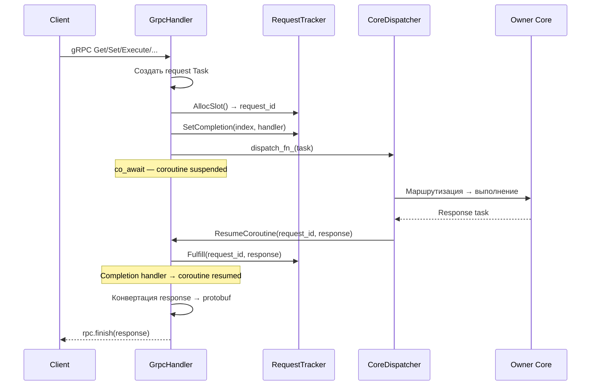

# Handlers-GrpcHandler — Обработчик gRPC

## Что это

`GrpcHandler` (`src/handlers/grpc_handler.h`) — входная точка внешнего протокола. Переводит gRPC-вызовы во внутреннюю модель `Task` и обратно, используя coroutine-based async модель.

`ProtoConvert` (`src/handlers/proto_convert.h`) — inline-конвертеры между protobuf `bytes` и `BinaryValue`.

## Зачем нужно

gRPC-специфика (protobuf сообщения, completion queues, async streams) не должна протекать в routing, storage и межъядерный transport. `GrpcHandler` изолирует весь протокольный слой в одном месте:

- принимает 7 типов RPC;
- собирает `Task` из protobuf;
- ждёт ответ через coroutine;
- конвертирует response обратно в protobuf.

## Как работает

### Coroutine lifecycle



### Паттерн `async_initiate`

Ключевой механизм — мост между callback-based `RequestTracker` и coroutine-based `awaitable`:

```cpp
boost::asio::awaitable<Task> WaitForResponse(Task task) {
    co_return co_await boost::asio::async_initiate<
        const boost::asio::use_awaitable_t<...>, void(Task)>(
        [this, task = std::move(task)](auto&& handler) mutable {
            auto shared = std::make_shared<Handler>(std::move(handler));
            uint64_t rid = tracker_.AllocSlot();
            uint32_t index = static_cast<uint32_t>(rid & 0xFFFFFFFF);
            task.request_id = rid;
            task.reply_to_core = core_id_;
            tracker_.SetCompletion(index, [this, index, shared]() {
                auto resp = tracker_.GetResponse(index);
                (*shared)(std::move(resp));
            });
            dispatch_fn_(std::move(task));
        },
        boost::asio::use_awaitable);
}
```

1. `async_initiate` создаёт completion handler;
2. Handler оборачивается в `shared_ptr` для продления lifetime;
3. Выделяется `request_id`, задача отправляется через `dispatch_fn_`;
4. Coroutine приостанавливается на `co_await`;
5. Когда ответ приходит → `Fulfill()` → handler вызван → coroutine возобновляется.

### 7 RPC-обработчиков

| RPC | Handler | Task Type |
|-----|---------|-----------|
| `Get` | `HandleGet` | `GET_REQUEST` → `GET_RESPONSE` |
| `Set` | `HandleSet` | `SET_REQUEST` → `SET_RESPONSE` |
| `BeginTransaction` | `HandleBeginTransaction` | `TX_BEGIN_REQUEST` → `TX_BEGIN_RESPONSE` |
| `Execute` | `HandleExecute` | `TX_EXECUTE_GET/SET_REQUEST` → `TX_EXECUTE_RESPONSE` |
| `Commit` | `HandleCommit` | `TX_COMMIT_REQUEST` → `TX_COMMIT_RESPONSE` |
| `Rollback` | `HandleRollback` | `TX_ROLLBACK_REQUEST` → `TX_ROLLBACK_RESPONSE` |
| `Heartbeat` | `HandleHeartbeat` | `TX_HEARTBEAT_REQUEST` → `TX_HEARTBEAT_RESPONSE` |

Все обработчики регистрируются через `agrpc::register_awaitable_rpc_handler` с `boost::asio::detached`.

### ProtoConvert — граница протокола

```cpp
inline BinaryValue FromProtoBytes(const std::string& bytes);
// Reinterpret protobuf string как BinaryValue
// Используется на входе: req.value() → BinaryValue

inline std::string ToProtoBytes(const BinaryValue& value);
// Reinterpret BinaryValue как protobuf string
// Используется на выходе: response.value → set_value()
```

Конвертация происходит **только** в `GrpcHandler` — ни `StorageEngine`, ни `KvExecutor`, ни `Router` не знают о protobuf.

## Публичный API

```cpp
class GrpcHandler {
public:
    GrpcHandler(int core_id, std::function<void(Task)> dispatch_fn);
    // core_id: всегда 0 (ingress core)
    // dispatch_fn: callback для отправки Task в CoreDispatcher

    db::Database::AsyncService& GetService();
    // Возвращает gRPC AsyncService для регистрации на сервере

    void RegisterHandlers(agrpc::GrpcContext& grpc_ctx);
    // Регистрирует все 7 RPC-обработчиков

    void ResumeCoroutine(uint64_t request_id, Task response);
    // Вызывается CoreDispatcher при получении response task
    // Делегирует в tracker_.Fulfill()

private:
    RequestTracker tracker_;  // 65536 слотов
};
```

## Связи с другими модулями

| Модуль | Взаимодействие |
|--------|---------------|
| [Async-RequestTracker](Async-RequestTracker) | Владеет `RequestTracker` для корреляции request/response |
| [Core-CoreDispatcher](Core-CoreDispatcher) | Вызывает `ResumeCoroutine()` при получении response |
| [Core-Worker](Core-Worker) | Регистрируется через `RegisterGrpcService()`, handlers через `AddStartupTask()` |
| [Core-Types](Core-Types) | `FromProtoBytes`/`ToProtoBytes` конвертируют в `BinaryValue` |

## См. также

- [gRPC-API](gRPC-API) — полный справочник по API (все RPC и сообщения)
- [Async-RequestTracker](Async-RequestTracker) — корреляция request/response
- [Core-CoreDispatcher](Core-CoreDispatcher) — маршрутизация ответов к GrpcHandler
- [Request-Flow](Request-Flow) — полный путь запроса через GrpcHandler
