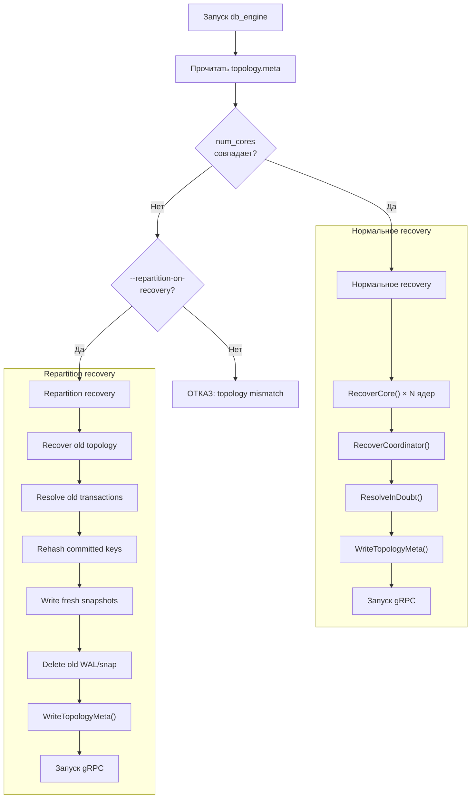
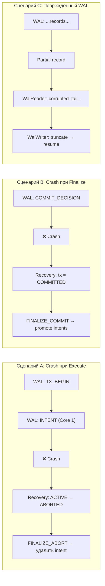
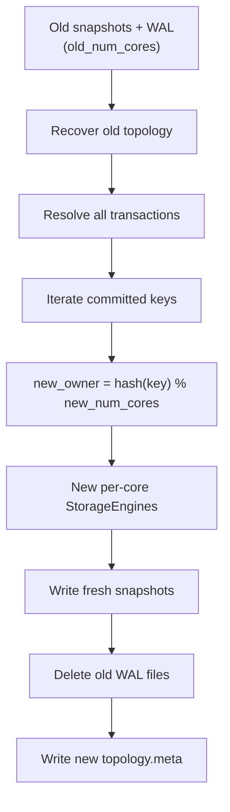

# Recovery — Восстановление после crash

## Что это

`RecoveryManager` (`src/recovery/recovery_manager.h`, `src/recovery/recovery_manager.cpp`) — оркестратор crash recovery. Управляет всеми фазами восстановления: валидация топологии, per-core recovery, восстановление координатора, repartitioning.

## Зачем нужно

После crash система должна:
- восстановить committed-данные из snapshot + WAL;
- разрешить in-doubt транзакции (PREPARE без final decision);
- обнаружить изменение числа ядер и перераспределить данные;
- начать принимать запросы только после полного восстановления.

## Как работает

### Фазы recovery



### Фаза 1: RecoverCore (per-core)

Выполняется параллельно для каждого ядра:

1. Проверить наличие `core_N.snap`;
2. Если есть → `CheckpointReader::Load()` → восстановить committed-данные;
3. Извлечь `wal_lsn` из заголовка snapshot;
4. Проверить наличие `core_N.wal`;
5. Если есть → `WalReader::ReadAll(min_lsn = wal_lsn)`;
6. Replay только определённых типов записей:

| Тип WAL-записи | Действие при replay |
|----------------|-------------------|
| `INTENT` | `storage.WriteIntent(key, value, tx_id)` |
| `COMMIT_FINALIZE` | `storage.CommitTransaction(tx_id, commit_ts)` |
| `ABORT_FINALIZE` | `storage.AbortTransaction(tx_id)` |
| `TX_BEGIN` | Пропускается (обрабатывается координатором) |
| `PREPARE` | Пропускается |
| `COMMIT_DECISION` | Пропускается (обрабатывается координатором) |
| `ABORT_DECISION` | Пропускается |
| `CHECKPOINT` | Пропускается |

### Фаза 2: RecoverCoordinator (Core 0)

Восстанавливает таблицу транзакций из Core 0 WAL:

```
Для каждой записи в core_0.wal:
  TX_BEGIN         → создать TxRecord(state=ACTIVE, snapshot_ts)
  COMMIT_DECISION  → обновить state=COMMITTED, commit_ts
  ABORT_DECISION   → обновить state=ABORTED
```

**Post-processing**: любая ACTIVE транзакция (без COMMIT/ABORT_DECISION) → помечается как ABORTED. Это консервативная политика: если финальное решение не записано в WAL, транзакция не может быть committed.

### Фаза 3: ResolveInDoubt

Отправляет finalize-операции на все ядра:

```
Для каждой транзакции в tx_table:
  COMMITTED → TX_FINALIZE_COMMIT_REQUEST на все ядра
  ABORTED   → TX_FINALIZE_ABORT_REQUEST на все ядра
```

### Crash-сценарии



### Repartition

Когда `num_cores` изменилось (с `--repartition-on-recovery`):



**Пример перемещения ключей:**

```
old_num_cores = 4, new_num_cores = 6

key "user:1"  → hash%4=1 (old Core 1)  → hash%6=5 (new Core 5)  ← переехал
key "order:9" → hash%4=3 (old Core 3)  → hash%6=3 (new Core 3)  ← остался
```

**Инварианты repartition:**
1. Нет live-трафика до завершения;
2. In-flight транзакции разрешаются под старой топологией;
3. Переносится только committed state (не intent'ы);
4. Создаётся fresh durability baseline (новые snapshot/WAL);
5. `layout_epoch` инкрементируется.

### Файлы на диске

| Файл | Формат | Описание |
|------|--------|----------|
| `core_N.wal` | WAL-записи | Per-core write-ahead log |
| `core_N.snap` | Snapshot | Per-core committed state |
| `topology.meta` | 24 bytes | `num_cores` + `layout_epoch` + CRC32c |

**topology.meta format:**

```
[0-3]   magic          0xDB544F50
[4-7]   version        1
[8-11]  num_cores      uint32
[12-19] layout_epoch   uint64
[20-23] crc32c         uint32 (masked)
```

## Публичный API

```cpp
class RecoveryManager {
public:
    static void WriteTopologyMeta(const std::string& data_dir,
                                  const TopologyMeta& meta);
    static std::optional<TopologyMeta> ReadTopologyMeta(const std::string& data_dir);
    static std::string ValidateTopology(const std::string& data_dir, int configured_cores);

    static uint64_t RecoverCore(int core_id, const std::string& data_dir,
                                StorageEngine& storage);
    static RecoveredCoordinatorState RecoverCoordinator(const std::string& data_dir);

    static void Repartition(const std::string& data_dir,
                            uint32_t old_num_cores, uint32_t new_num_cores,
                            std::vector<std::unique_ptr<StorageEngine>>& new_storages);

    static std::string WalPath(const std::string& data_dir, int core_id);
    static std::string SnapPath(const std::string& data_dir, int core_id);
    static std::string TopologyPath(const std::string& data_dir);
};

struct RecoveredCoordinatorState {
    std::unordered_map<uint64_t, TxRecord> tx_table;
    uint64_t max_tx_id;
    uint64_t max_snapshot_ts;
};
```

## Связи с другими модулями

| Модуль | Взаимодействие |
|--------|---------------|
| `main.cpp` | Вызывает `ValidateTopology`, `RecoverCore`, `Repartition` при старте |
| [WAL](WAL) | `WalReader::ReadAll()` для replay |
| [Checkpoint](Checkpoint) | `CheckpointReader::Load()` / `CheckpointWriter::Write()` |
| [Storage-StorageEngine](Storage-StorageEngine) | `WriteIntent()`, `CommitTransaction()`, `AbortTransaction()`, `RestoreCommitted()` |
| [Transaction-TxCoordinator](Transaction-TxCoordinator) | `LoadRecoveredState()`, `ResolveInDoubt()` |

## См. также

- [WAL](WAL) — формат WAL-записей, используемых при replay
- [Checkpoint](Checkpoint) — формат snapshot-файлов
- [Transaction-TxCoordinator](Transaction-TxCoordinator) — восстановление координатора
- [Build-Deploy](Build-Deploy) — флаг `--repartition-on-recovery`
- [Design-MVCC-Transactions](Design-MVCC-Transactions) — дизайн recovery при смене числа ядер
