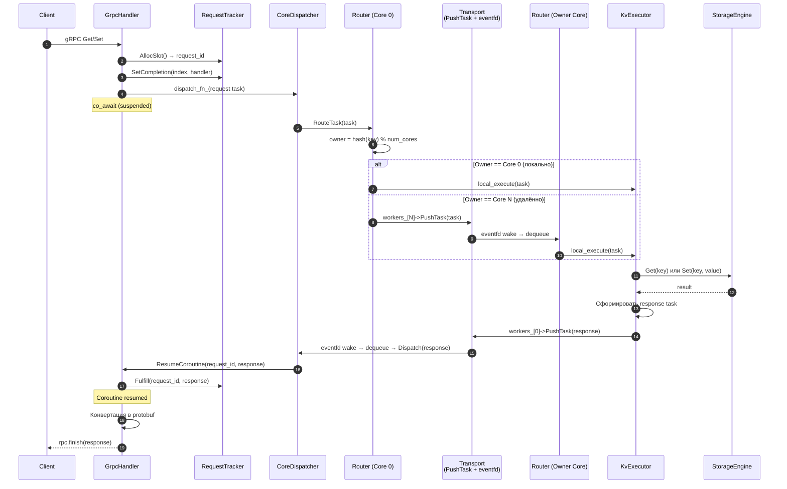

# Request-Flow — Путь запроса

## Что это

Полный end-to-end flow нетранзакционных `Get` и `Set` запросов через все слои системы.

## Sequence diagram



## Пошаговое описание

### Шаг 1: Клиент отправляет запрос

Клиент подключается к единственному gRPC ingress на **Core 0** и вызывает `Get` или `Set`.

### Шаг 2: GrpcHandler создаёт Task

[GrpcHandler](Handlers-GrpcHandler) конвертирует protobuf-запрос во внутренний [Task](Core-Task):
- `task.type = GET_REQUEST` или `SET_REQUEST`
- `task.key = req.key()`
- `task.value = FromProtoBytes(req.value())` (только для Set)

### Шаг 3: RequestTracker выделяет correlation slot

[RequestTracker](Async-RequestTracker) через [SlabAllocator](Core-SlabAllocator):
- выдаёт `request_id = (generation << 32) | index`
- сохраняет completion handler
- помечает `task.reply_to_core = 0`

### Шаг 4: Coroutine приостанавливается

`WaitForResponse()` использует `async_initiate` + `co_await` — coroutine suspended до прихода ответа.

### Шаг 5: CoreDispatcher направляет в Router

[CoreDispatcher](Core-CoreDispatcher) видит request task → `Router.RouteTask()`.

### Шаг 6: Router вычисляет owner

[Router](Router): `owner = std::hash<std::string>{}(key) % num_cores`

**Два сценария:**
- **Локально** (owner == Core 0): `local_execute(task)` → KvExecutor сразу;
- **Удалённо** (owner == Core N): `workers_[N]->PushTask(task)` → transport.

### Шаг 7: Transport (если удалённо)

[Worker](Core-Worker): task помещается в `ConcurrentQueue` целевого ядра, `eventfd` будит его event loop.

### Шаг 8: KvExecutor выполняет

На owner core [KvExecutor](Execution-KvExecutor) вызывает [StorageEngine](Storage-StorageEngine):
- `GET_REQUEST` → `storage.Get(key)`
- `SET_REQUEST` → `storage.Set(key, value)`

### Шаг 9: Response возвращается на Core 0

KvExecutor формирует response task и отправляет через `workers_[0]->PushTask()`.

### Шаг 10: CoreDispatcher → GrpcHandler

CoreDispatcher распознаёт response task → `GrpcHandler.ResumeCoroutine(request_id, response)`.

### Шаг 11: Coroutine возобновляется

`RequestTracker.Fulfill()` вызывает completion handler → coroutine resumed → protobuf response сформирован → `rpc.finish()`.

## Время жизни request_id

```
Allocate → [в Task.request_id] → transport → [в response.request_id] → Fulfill → Free
```

Generation инкрементируется при Free, предотвращая ABA при переиспользовании слота.

## См. также

- [Transaction-Flow](Transaction-Flow) — flow транзакционных запросов через 2PC
- [Architecture-Overview](Architecture-Overview) — общая архитектура
- [gRPC-API](gRPC-API) — API-методы Get и Set
