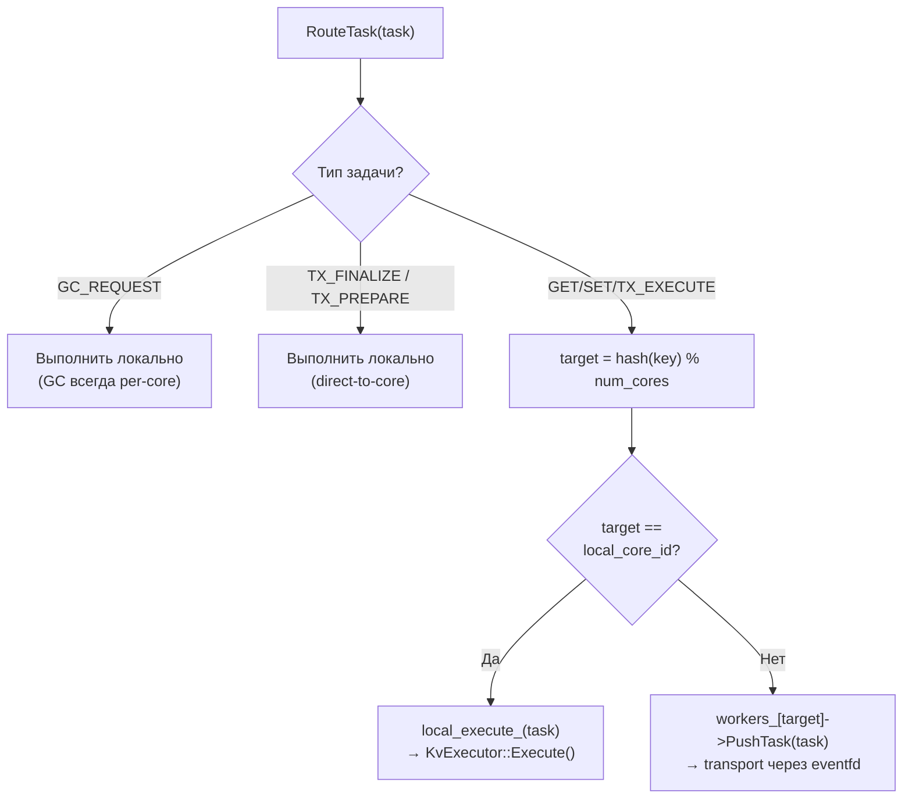

# Router — Маршрутизация по ключам

## Что это

`Router` (`src/router/router.h`, `src/router/router.cpp`) — слой принятия решения о владении ключом. Определяет, на каком ядре должна выполняться операция, и доставляет задачу туда.

## Зачем нужно

В thread-per-core модели каждый ключ принадлежит ровно одному ядру:

```
owner = std::hash<std::string>{}(key) % num_cores
```

Router нужен отдельно от Executor и Transport, чтобы:
- логика владения ключом была простой и детерминированной;
- routing не смешивался с execution;
- все ядра независимо вычисляли одно и то же правило без координации.

## Как работает

### Алгоритм маршрутизации



### Специальные случаи

| Тип задачи | Поведение | Причина |
|------------|-----------|---------|
| `GC_REQUEST` | Всегда локально | GC — per-core операция |
| `TX_PREPARE_REQUEST` | Всегда локально | Отправляется напрямую на participant core |
| `TX_FINALIZE_COMMIT/ABORT_REQUEST` | Всегда локально | Отправляется напрямую на participant core |
| `GET/SET_REQUEST` | По hash(key) | Стандартная маршрутизация |
| `TX_EXECUTE_GET/SET_REQUEST` | По hash(key) | Стандартная маршрутизация |

### SendToCore — прямая адресация

```cpp
void SendToCore(int target_core, Task task);
```

Используется `TxCoordinator` для отправки `TX_PREPARE` и `TX_FINALIZE` на конкретные participant cores, минуя key-based routing.

## Публичный API

```cpp
class Router {
public:
    Router(int local_core_id,
           std::vector<Worker*> all_workers,
           std::function<void(Task)> local_execute);
    // local_core_id: ID текущего ядра
    // all_workers: указатели на все Worker'ы (по индексу = core_id)
    // local_execute: callback для локального выполнения (KvExecutor::Execute)

    [[nodiscard]] int RouteKey(const std::string& key) const noexcept;
    // Возвращает owner core: hash(key) % num_cores

    void RouteTask(Task task);
    // Маршрутизирует задачу: локально или на удалённое ядро.

    void SendToCore(int target_core, Task task);
    // Отправляет задачу на конкретное ядро (для 2PC finalize/prepare).
};
```

### Инварианты маршрутизации

1. **Детерминизм**: один и тот же ключ всегда маршрутизируется на одно ядро;
2. **Равномерность**: `std::hash` распределяет ключи равномерно;
3. **Независимость**: все ядра вычисляют ownership независимо, без координации;
4. **Неизменность**: правило маршрутизации не меняется во время работы;
5. **Единственный владелец**: каждый ключ принадлежит ровно одному ядру.

## Связи с другими модулями

| Модуль | Взаимодействие |
|--------|---------------|
| [Core-CoreDispatcher](Core-CoreDispatcher) | Вызывает `RouteTask()` для request задач на Core 0 |
| [Core-Worker](Core-Worker) | `PushTask()` для отправки на удалённое ядро; task_processor = `RouteTask()` на worker cores |
| [Execution-KvExecutor](Execution-KvExecutor) | `local_execute` callback выполняет задачу через KvExecutor |
| [Transaction-TxCoordinator](Transaction-TxCoordinator) | Вызывает `RouteTask()` для TX_EXECUTE, `SendToCore()` для PREPARE/FINALIZE |

## См. также

- [Core-Worker](Core-Worker) — transport между ядрами (ConcurrentQueue + eventfd)
- [Execution-KvExecutor](Execution-KvExecutor) — локальное выполнение задачи на owner core
- [Request-Flow](Request-Flow) — полный путь запроса через Router
- [Recovery](Recovery) — repartitioning при изменении `num_cores`
