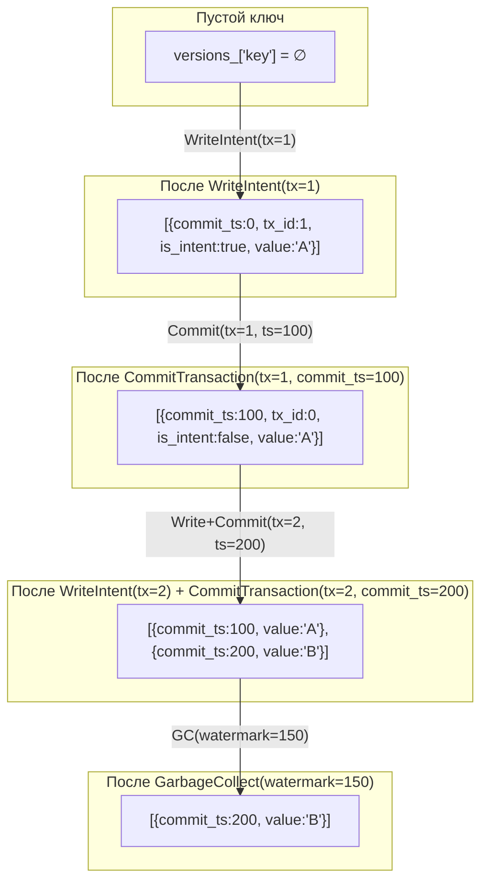
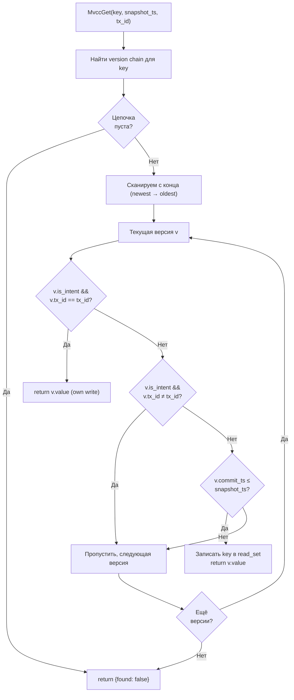
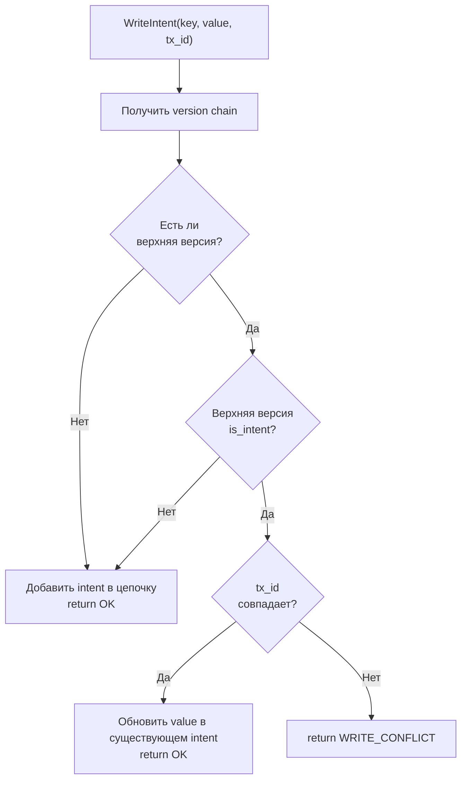

# Storage-StorageEngine — MVCC-хранилище

## Что это

`StorageEngine` (`src/storage/storage_engine.h`) — per-core хранилище данных с поддержкой Multi-Version Concurrency Control (MVCC). Каждое ядро владеет одним экземпляром `StorageEngine`, управляющим своей партицией ключей.

## Зачем нужно

В thread-per-core архитектуре каждый ключ принадлежит ровно одному ядру (`hash(key) % num_cores`). `StorageEngine` обеспечивает:

- **Snapshot Isolation** — транзакции читают консистентный срез данных на `snapshot_ts`;
- **Write intents** — uncommitted записи видны только своей транзакции;
- **OCC validation** — оптимистичная проверка конфликтов при `PREPARE`;
- **Garbage collection** — очистка устаревших версий по watermark.

Данные не разделяются между ядрами через locks — каждый `StorageEngine` работает single-threaded на своём ядре.

## Как работает

### Структуры данных

#### `VersionedValue` — одна версия значения

```cpp
struct VersionedValue {
    uint64_t commit_ts{0};       // Timestamp коммита (0 = intent)
    BinaryValue value;            // Значение
    uint64_t tx_id{0};           // ID транзакции-владельца (0 = committed)
    bool is_intent{false};       // true = uncommitted write intent
    bool is_deleted{false};      // true = tombstone (удаление)
};
```

#### Внутренние структуры `StorageEngine`

```cpp
// Простое KV для нетранзакционных операций
std::unordered_map<std::string, BinaryValue> data_;

// MVCC version chains: ключ → [oldest_version, ..., newest_version]
std::unordered_map<std::string, std::vector<VersionedValue>> versions_;

// Индекс intent'ов: tx_id → {ключи с intent'ами}
std::unordered_map<uint64_t, std::unordered_set<std::string>> tx_intents_;

// Read set: tx_id → {прочитанные ключи} (mutable для const MvccGet)
mutable std::unordered_map<uint64_t, std::unordered_set<std::string>> tx_read_set_;
```

### Жизненный цикл version chain



### Алгоритм MVCC-чтения (Snapshot Isolation)



**Ключевой инвариант**: собственные intent'ы всегда видны своей транзакции, независимо от `snapshot_ts`.

### Обнаружение write-write конфликтов



## Публичный API

### Нетранзакционные операции

```cpp
void Set(const std::string& key, BinaryValue value);
// Безусловная запись в data_ map.

[[nodiscard]] std::optional<BinaryValue> Get(const std::string& key) const;
// Чтение из data_ map. nullopt если ключ не найден.

void Delete(const std::string& key);
// Удаление из data_ map.

[[nodiscard]] std::size_t Size() const noexcept;
// Количество ключей в data_ map.
```

### MVCC-чтение

```cpp
[[nodiscard]] MvccReadResult MvccGet(const std::string& key,
                                     uint64_t snapshot_ts,
                                     uint64_t tx_id) const;
```

Возвращает:
```cpp
struct MvccReadResult {
    bool found{false};       // Видимая версия найдена
    BinaryValue value;        // Значение (пусто если !found)
    bool is_deleted{false};  // Версия — tombstone
};
```

### MVCC-запись (intent)

```cpp
WriteIntentResult WriteIntent(const std::string& key,
                              BinaryValue value,
                              uint64_t tx_id);
```

Возвращает:
```cpp
enum class WriteIntentResult : uint8_t {
    OK,              // Intent создан/обновлён
    WRITE_CONFLICT,  // Другая транзакция уже имеет intent на этот ключ
};
```

### Финализация транзакций

```cpp
void CommitTransaction(uint64_t tx_id, uint64_t commit_ts);
// Промоутит все intent'ы транзакции в committed versions с commit_ts.
// is_intent → false, commit_ts → заданный, tx_id → 0.

void AbortTransaction(uint64_t tx_id);
// Удаляет все intent'ы транзакции из version chains.
```

### OCC-валидация (2PC Prepare)

```cpp
[[nodiscard]] PrepareResult ValidatePrepare(uint64_t tx_id) const;
```

Возвращает:
```cpp
struct PrepareResult {
    bool can_commit{false};  // Все intent'ы на месте
    std::string reason;      // Причина отказа (пусто если can_commit)
};
```

Проверяет для каждого ключа в `tx_intents_[tx_id]`:
1. Version chain существует;
2. Верхняя версия — intent;
3. Intent принадлежит этой транзакции (не был заменён).

### Garbage Collection

```cpp
size_t GarbageCollect(uint64_t watermark);
// Удаляет committed версии с commit_ts < watermark.
// ВСЕГДА сохраняет последнюю committed версию каждого ключа.
// Удаляет tombstone, если он единственная версия и commit_ts < watermark.
// Возвращает количество удалённых версий.
```

### Утилиты

```cpp
[[nodiscard]] const std::unordered_set<std::string>* GetReadSet(uint64_t tx_id) const;
// Read set для conflict detection (используется TxCoordinator).

void ForEachLatestCommitted(
    std::function<void(const std::string& key, const BinaryValue& value,
                       uint64_t commit_ts, bool is_deleted)> callback) const;
// Итерация по всем ключам с их последней committed версией.
// Используется для checkpoint'а и repartition.

void RestoreCommitted(const std::string& key, BinaryValue value,
                      uint64_t commit_ts, bool is_deleted);
// Добавляет committed версию в version chain.
// Используется при recovery из checkpoint.

void Clear();
// Очищает все данные, версии, intent'ы и read set'ы.
```

## Связи с другими модулями

| Модуль | Взаимодействие |
|--------|---------------|
| [Execution-KvExecutor](Execution-KvExecutor) | Вызывает Get/Set/MvccGet/WriteIntent/CommitTransaction/AbortTransaction |
| [Checkpoint](Checkpoint) | `ForEachLatestCommitted()` при записи snapshot; `RestoreCommitted()` при загрузке |
| [Recovery](Recovery) | `RecoverCore()` replay'ит WAL через WriteIntent/CommitTransaction/AbortTransaction |
| [Router](Router) | Каждый Router имеет callback к локальному KvExecutor → StorageEngine |

## См. также

- [Execution-KvExecutor](Execution-KvExecutor) — dispatch операций к StorageEngine
- [Transaction-TxCoordinator](Transaction-TxCoordinator) — 2PC координация, использующая ValidatePrepare
- [WAL](WAL) — write-ahead log перед мутациями StorageEngine
- [Checkpoint](Checkpoint) — сериализация StorageEngine в snapshot
- [Transaction-Flow](Transaction-Flow) — полный путь транзакции через 2PC
