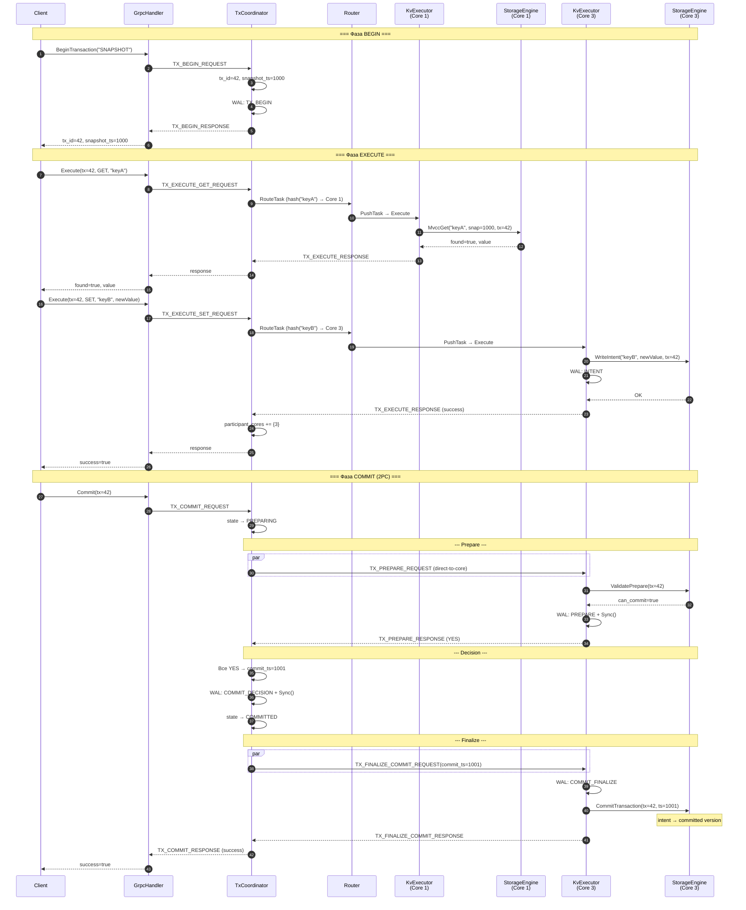
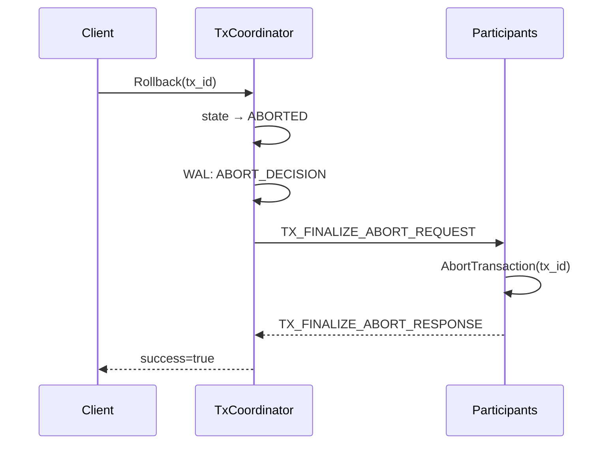

# Transaction-Flow — Путь транзакции

## Что это

Полный end-to-end flow транзакции через 2PC: Begin → Execute → Commit (Prepare → Vote → Finalize).

## Полный sequence diagram



## Пошаговое описание

### 1. Begin

Клиент вызывает `BeginTransaction`. [TxCoordinator](Transaction-TxCoordinator) на Core 0:
- назначает `tx_id` (автоинкремент);
- назначает `snapshot_ts` (автоинкремент);
- создаёт `TxRecord` со state=ACTIVE;
- пишет `TX_BEGIN` в WAL Core 0;
- возвращает `tx_id` и `snapshot_ts` клиенту.

### 2. Execute

Для каждой операции внутри транзакции:

**GET**: маршрутизируется на owner core → `MvccGet(key, snapshot_ts, tx_id)`:
- Видит собственные intent'ы (read-your-own-writes);
- Видит committed версии ≤ snapshot_ts;
- Не видит чужие intent'ы.

**SET**: маршрутизируется на owner core → `WriteIntent(key, value, tx_id)`:
- Создаёт uncommitted intent;
- Если другая транзакция уже имеет intent → `WRITE_CONFLICT`;
- INTENT записывается в WAL;
- TxCoordinator добавляет ядро в `participant_cores`.

### 3. Commit — Prepare phase

TxCoordinator отправляет `TX_PREPARE_REQUEST` на каждый participant core.

Каждый participant:
1. `StorageEngine.ValidatePrepare(tx_id)` — проверяет, что все intent'ы на месте;
2. WAL: запись PREPARE;
3. `WAL.Sync()` — **fdatasync** обеспечивает durability перед голосованием;
4. Возвращает YES или NO.

### 4. Commit — Decision phase

TxCoordinator собирает голоса:
- **Все YES** → назначает `commit_ts`, пишет `COMMIT_DECISION` в WAL, `Sync()`;
- **Хотя бы один NO** → пишет `ABORT_DECISION` в WAL.

### 5. Commit — Finalize phase

TxCoordinator рассылает `TX_FINALIZE_COMMIT_REQUEST` или `TX_FINALIZE_ABORT_REQUEST`.

**На COMMIT**: participant вызывает `CommitTransaction(tx_id, commit_ts)` — intent'ы промоутятся в committed версии.

**На ABORT**: participant вызывает `AbortTransaction(tx_id)` — intent'ы удаляются.

### 6. Response

Когда все participant'ы подтвердили finalize → ответ возвращается клиенту.

## Rollback



## Конфликтные сценарии

### Write-Write конфликт

```
Tx1: WriteIntent("key", "A", tx_id=1) → OK
Tx2: WriteIntent("key", "B", tx_id=2) → WRITE_CONFLICT
     → Execute response: success=false, error="write_write_conflict"
```

Обнаруживается **сразу** при Execute, не при Commit.

### Stale transaction

```
Tx начата → клиент исчез → нет heartbeat → 30с timeout
→ ReapStaleTransactions() → state=ABORTED → FINALIZE_ABORT
```

## WAL-записи в контексте транзакции

| Фаза | Компонент | WAL-запись | Sync? |
|------|-----------|-----------|-------|
| Begin | TxCoordinator (Core 0) | TX_BEGIN | Нет |
| Execute SET | KvExecutor (owner core) | INTENT | Нет |
| Prepare YES | KvExecutor (owner core) | PREPARE | **Да** |
| Decision | TxCoordinator (Core 0) | COMMIT/ABORT_DECISION | **Да** |
| Finalize | KvExecutor (owner core) | COMMIT/ABORT_FINALIZE | Нет |

## См. также

- [Request-Flow](Request-Flow) — flow нетранзакционных запросов
- [Transaction-TxCoordinator](Transaction-TxCoordinator) — детали координатора
- [Storage-StorageEngine](Storage-StorageEngine) — MVCC-механика
- [gRPC-API](gRPC-API) — API транзакционных методов
- [Recovery](Recovery) — восстановление in-doubt транзакций
