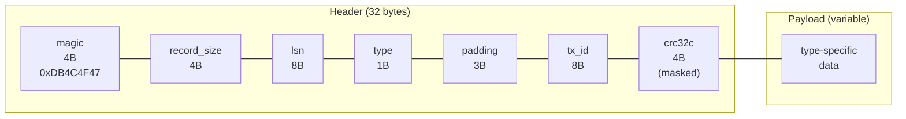
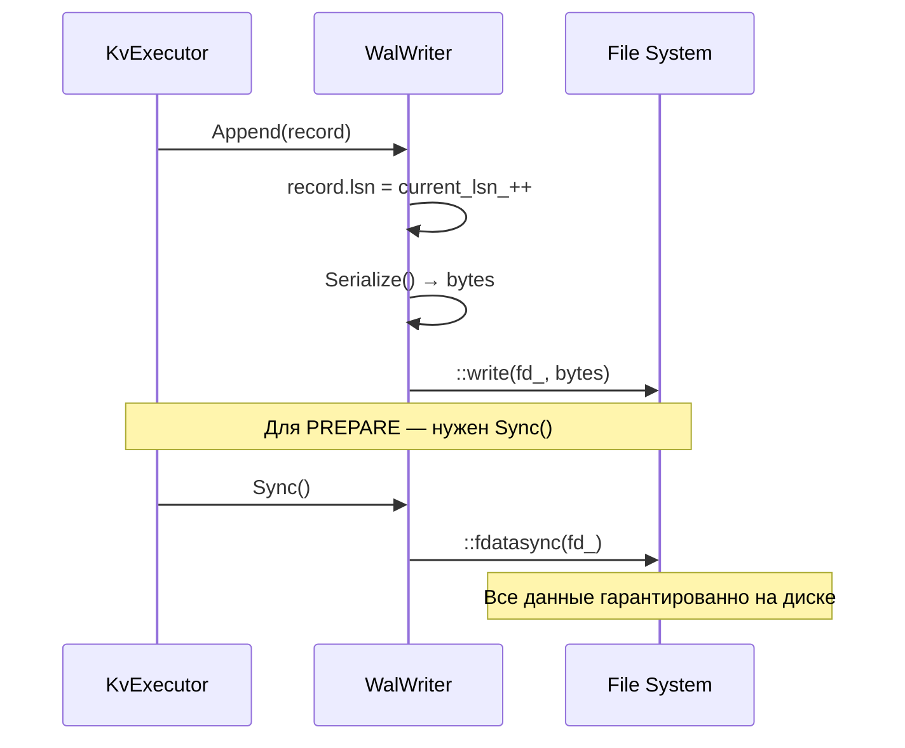
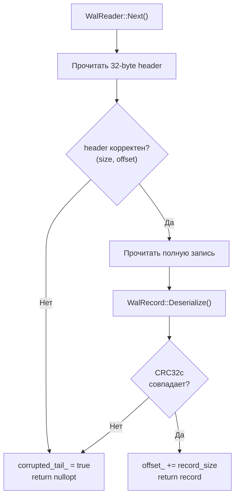

# WAL — Write-Ahead Log

## Что это

Модуль `src/wal/` реализует per-core write-ahead log для обеспечения durability. Включает четыре компонента:

- **`WalWriter`** — append-only запись с автоматическим LSN;
- **`WalReader`** — последовательное чтение с обнаружением повреждений;
- **`WalRecord`** — бинарный формат записи с CRC32c;
- **`CRC32c`** — аппаратно-ускоренная контрольная сумма.

## Зачем нужно

Без WAL нет durability (буква D в ACID). Принцип write-ahead:

```
1. Записать решение/изменение в WAL
2. fdatasync() WAL
3. Только тогда считать изменение durable
4. Применить к in-memory StorageEngine
```

Per-core WAL (один файл на ядро) идеально подходит thread-per-core модели:
- один writer на shard — нет contention;
- нет shared mutable log state между ядрами;
- recovery естественно раскладывается по core.

## Как работает

### Типы WAL-записей

```
WalRecordType (uint8_t):
  TX_BEGIN          = 1    // Начало транзакции: snapshot_ts
  INTENT            = 2    // Write intent: key, value, is_deleted
  PREPARE           = 3    // 2PC prepare vote: vote_yes
  COMMIT_DECISION   = 4    // Решение commit: commit_ts
  ABORT_DECISION    = 5    // Решение abort
  COMMIT_FINALIZE   = 6    // Финализация commit: commit_ts
  ABORT_FINALIZE    = 7    // Финализация abort
  CHECKPOINT        = 8    // Маркер checkpoint: snapshot_lsn
```

### Бинарный формат записи



**Детальный layout:**

```
Offset  Размер  Поле           Описание
[0-3]   4B      magic          0xDB4C4F47 (идентификатор WAL)
[4-7]   4B      record_size    Полный размер записи (header + payload)
[8-15]  8B      lsn            Log Sequence Number (монотонно возрастает)
[16]    1B      type           WalRecordType (1-8)
[17-19] 3B      padding        Нулевые байты
[20-27] 8B      tx_id          ID транзакции
[28-31] 4B      crc32c         Masked CRC32c всей записи
```

**Payload по типам:**

| Тип | Payload | Размер |
|-----|---------|--------|
| `TX_BEGIN` | `snapshot_ts` (uint64) | 8B |
| `INTENT` | `key_sz` (uint32) + `key` + `val_sz` (uint32) + `value` + `is_deleted` (uint8) | Variable |
| `PREPARE` | `vote_yes` (uint8) | 1B |
| `COMMIT_DECISION` | `commit_ts` (uint64) | 8B |
| `COMMIT_FINALIZE` | `commit_ts` (uint64) | 8B |
| `ABORT_DECISION` | — | 0B |
| `ABORT_FINALIZE` | — | 0B |
| `CHECKPOINT` | `snapshot_lsn` (uint64) | 8B |

### Путь записи



**Семантика Sync:**
- `Sync()` вызывается **только при PREPARE** — для гарантии durability перед отправкой YES-vote;
- INTENT-записи группируются и sync'ятся вместе с PREPARE;
- `fdatasync()` — синхронизирует данные, но не обязательно метаданные файла.

### Путь чтения и recovery



### Обработка повреждённого хвоста

При открытии существующего WAL-файла `WalWriter`:

1. Читает все записи через `WalReader`;
2. Если `HasCorruptedTail()` — обрезает файл до `ValidOffset()` (последняя целая запись);
3. Вызывает `fdatasync()` для фиксации обрезки;
4. Продолжает с `max_lsn + 1`.

Это гарантирует, что частичная запись при crash не повредит последующие операции.

### CRC32c

**Аппаратное ускорение (SSE4.2):**
- Использует intrinsics `_mm_crc32_u64`, `_mm_crc32_u32`, `_mm_crc32_u8`;
- Доступно на x86-64 с SSE4.2;
- ~10x быстрее программной реализации для больших буферов.

**Программный fallback:**
- Lookup-таблица на 256 записей, сгенерированная в compile-time (`constexpr`);
- Полином Кастаньоли: `0x82F63B78`;
- Побайтовая обработка.

**LevelDB-style masking:**

```cpp
uint32_t Crc32cMask(uint32_t crc);
// masked = ((crc >> 15) | (crc << 17)) + 0xa282ead8

uint32_t Crc32cUnmask(uint32_t masked);
// crc = rotate_right((masked - 0xa282ead8), 17)
```

Зачем маскирование:
- Без маскирования полностью нулевой блок даёт CRC = 0;
- Маскирование предотвращает false positive на неинициализированной памяти;
- Тот же подход, что в LevelDB и RocksDB.

## Публичный API

### `WalWriter`

```cpp
class WalWriter {
public:
    explicit WalWriter(const std::string& path);
    // Открывает/создаёт WAL-файл.
    // Если файл существует — читает все записи, обрезает повреждённый хвост,
    // продолжает с max_lsn + 1.

    void Append(WalRecord record);
    // Присваивает record.lsn = current_lsn_++
    // Сериализует и записывает в файл.

    void Sync();
    // fdatasync() — все Append с последнего Sync на диске.

    uint64_t CurrentLsn() const noexcept;
    // Следующий LSN, который будет присвоен.

    const std::string& Path() const noexcept;
    // Путь к WAL-файлу.
};
```

### `WalReader`

```cpp
class WalReader {
public:
    explicit WalReader(const std::string& path);
    // Открывает WAL-файл для чтения.

    std::optional<WalRecord> Next();
    // Читает следующую запись. nullopt при EOF или повреждении.

    std::vector<WalRecord> ReadAll(uint64_t min_lsn = 0);
    // Читает все записи с lsn > min_lsn.

    bool HasCorruptedTail() const noexcept;
    // true если обнаружена неполная/повреждённая запись.

    size_t ValidOffset() const noexcept;
    // Offset после последней валидной записи (для обрезки).
};
```

### `WalRecord`

```cpp
struct WalRecord {
    WalRecordType type;
    uint64_t lsn{0};
    uint64_t tx_id{0};

    // Payload-поля (заполняются по типу):
    uint64_t snapshot_ts{0};      // TX_BEGIN
    std::string key;               // INTENT
    BinaryValue value;             // INTENT
    bool is_deleted{false};        // INTENT
    bool vote_yes{false};          // PREPARE
    uint64_t commit_ts{0};        // COMMIT_DECISION, COMMIT_FINALIZE
    uint64_t snapshot_lsn{0};     // CHECKPOINT

    [[nodiscard]] std::vector<std::byte> Serialize() const;
    static std::optional<WalRecord> Deserialize(const std::byte* data, size_t size);
};
```

### CRC32c функции

```cpp
inline uint32_t Crc32c(const void* data, size_t size);     // Вычислить CRC32c
inline uint32_t Crc32cMask(uint32_t crc);                   // Замаскировать
inline uint32_t Crc32cUnmask(uint32_t masked);              // Размаскировать
```

## Инварианты

1. **LSN монотонно возрастает** — никогда не переиспользуется и не сбрасывается;
2. **LSN начинается с 1** (не 0);
3. **Write-ahead guarantee** — запись в WAL перед мутацией StorageEngine;
4. **Sync при PREPARE** — `fdatasync()` перед отправкой YES-vote;
5. **Повреждённый хвост обрезается** — неполная запись не влияет на recovery;
6. **CRC32c на каждой записи** — целостность гарантирована.

## Связи с другими модулями

| Модуль | Взаимодействие |
|--------|---------------|
| [Execution-KvExecutor](Execution-KvExecutor) | Вызывает `Append()` для INTENT, PREPARE, COMMIT/ABORT_FINALIZE; `Sync()` при PREPARE |
| [Transaction-TxCoordinator](Transaction-TxCoordinator) | Вызывает `Append()` для TX_BEGIN, COMMIT/ABORT_DECISION |
| [Recovery](Recovery) | `WalReader::ReadAll()` для replay при recovery |
| [Checkpoint](Checkpoint) | CHECKPOINT-запись фиксирует snapshot LSN |

## См. также

- [Recovery](Recovery) — replay WAL при восстановлении после crash
- [Checkpoint](Checkpoint) — snapshot, который сокращает объём WAL replay
- [Execution-KvExecutor](Execution-KvExecutor) — точки интеграции с WAL
- [Storage-StorageEngine](Storage-StorageEngine) — MVCC-хранилище, защищаемое WAL
