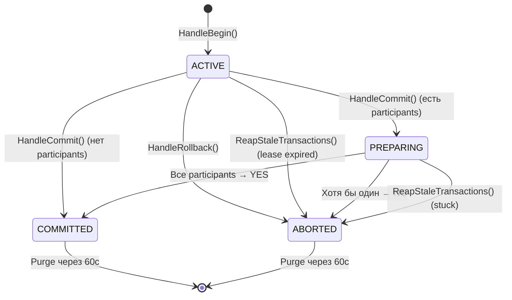
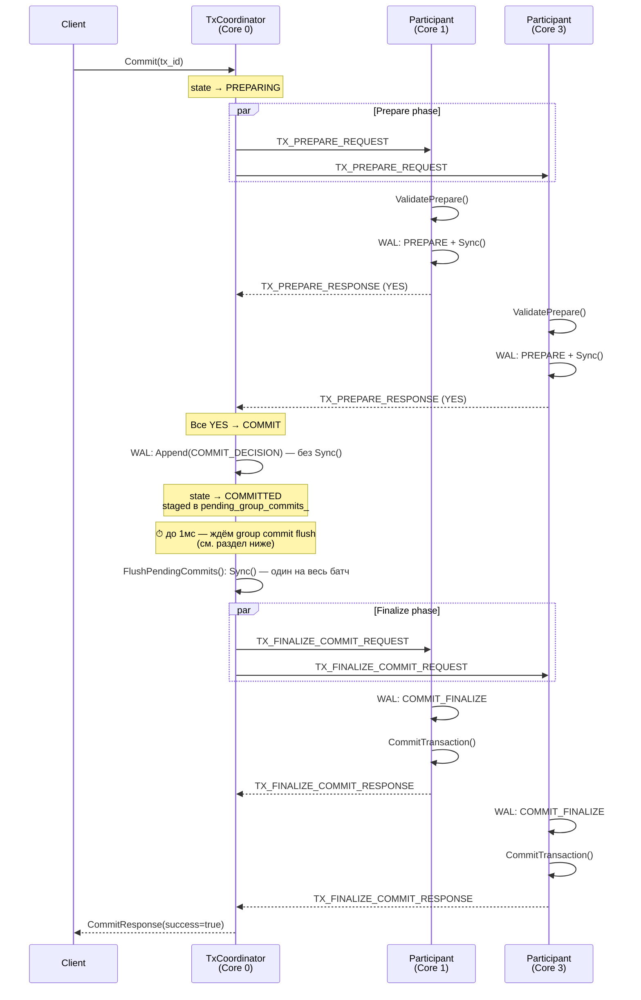
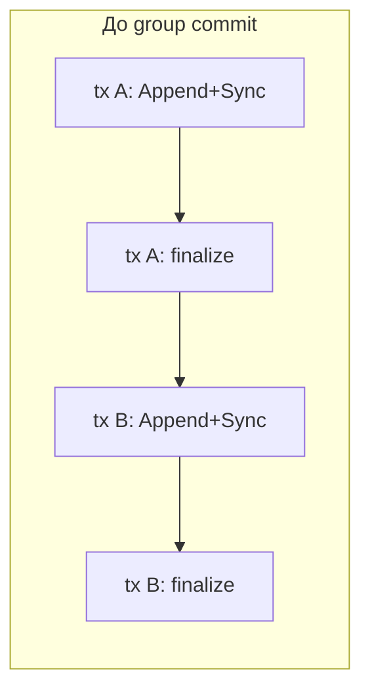
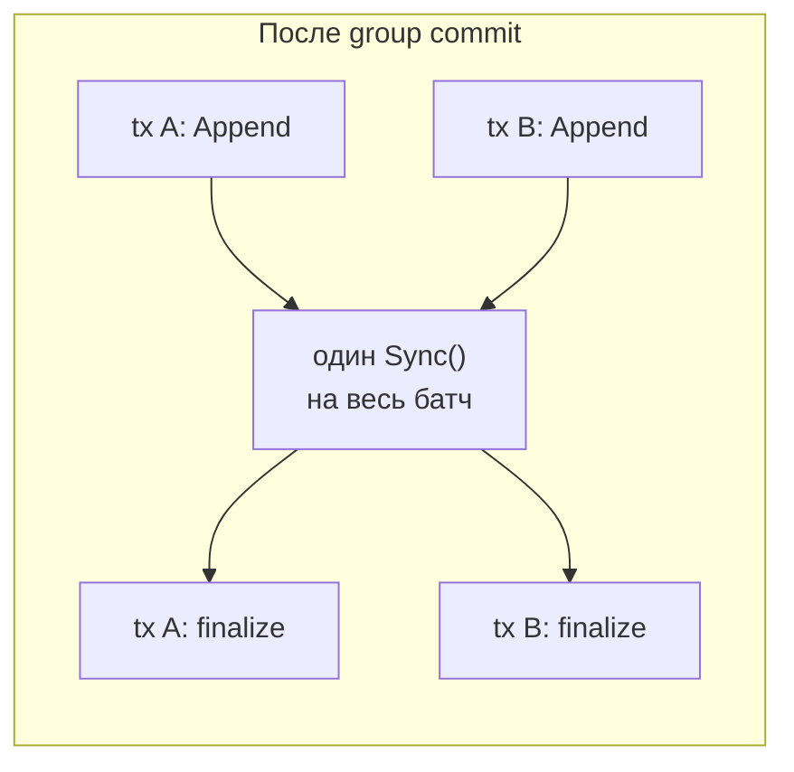
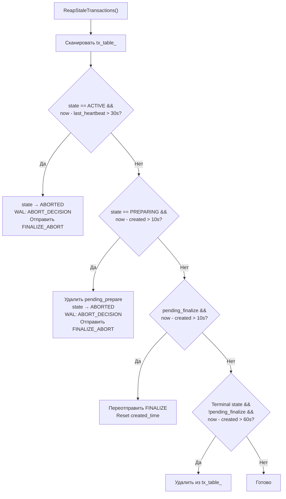

# Transaction-TxCoordinator — Координатор транзакций

## Что это

`TxCoordinator` (`src/transaction/tx_coordinator.h`, `src/transaction/tx_coordinator.cpp`) — координатор Two-Phase Commit (2PC) на Core 0. Управляет полным жизненным циклом транзакций: Begin → Execute → Prepare → Commit/Abort, плюс stale transaction cleanup.

## Зачем нужно

В multi-key транзакции ключи могут принадлежать разным ядрам:

```
key A → Core 1
key B → Core 3
key C → Core 2
```

Нужен единый компонент, который:
- создаёт `tx_id` и `snapshot_ts`;
- назначает `priority` (явный из запроса или `kTxPriorityNormal` по умолчанию) — используется только для retry-backoff подсказки при write-write конфликтах, см. [[Design-MVCC-Transactions]];
- отслеживает участников (participant cores);
- координирует 2PC: собирает голоса, принимает решение, рассылает finalize;
- управляет stale транзакциями (lease expiration, stuck detection).

Core 0 — естественный кандидат, так как он уже единственная ingress-точка.

## Как работает

### State machine транзакции



### Структуры данных

```cpp
enum class TxState : uint8_t {
    ACTIVE,      // Транзакция выполняется
    PREPARING,   // Фаза PREPARE: ожидание голосов
    COMMITTED,   // Решение COMMIT принято
    ABORTED,     // Решение ABORT принято
};

struct TxRecord {
    uint64_t tx_id;
    uint64_t snapshot_ts;
    uint64_t commit_ts;
    TxState state;
    std::unordered_set<int> participant_cores;  // Ядра с intent'ами
    uint32_t priority{kTxPriorityNormal};  // Только для retry-backoff, не даёт права вытеснить intent
    Clock::TimePoint created_time;
    Clock::TimePoint last_heartbeat_time;
};

struct PendingPrepare {
    uint64_t client_request_id;   // Для ответа клиенту
    uint64_t tx_id;
    int remaining;                // Осталось голосов
    bool any_no;                  // Есть ли отказ
    Clock::TimePoint created_time;
};

struct PendingFinalize {
    uint64_t client_request_id;
    uint64_t tx_id;
    int remaining;                // Осталось ACK
    bool is_commit;               // commit или abort
    Clock::TimePoint created_time;
};

// Коммит, чей WAL-record уже дописан (Append), но ещё не засинкан —
// ждёт группового FlushPendingCommits(). См. "Group commit" ниже.
struct PendingGroupCommit {
    PendingFinalize finalize;
    uint64_t commit_ts;
    std::unordered_set<int> participants;
};
```

### 2PC message flow



### Group commit — батчинг fsync

**Проблема.** Нагрузочное тестирование (`bench/`) показало: TX throughput упирался в плоский потолок ~850-870 tx/s
независимо от клиентской конкурентности (32→512 потоков), а `perf`-профилирование Core 0 под нагрузкой показало
низкую загрузку CPU (~14%) при жёстком потолке throughput — признак блокировки на I/O, не на вычислениях. Причина:
`HandlePrepareResponse` делал `wal_->Append(rec); wal_->Sync();` — один синхронный `fdatasync()` **на каждую
транзакцию**, инлайново внутри однопоточного task-loop координатора. `1 / 870 tx/s ≈ 1.15мс` — это и была цена
одного `fdatasync()` на диске.

**Решение.** Вместо немедленного `Sync()` после `Append()`, коммит-решение складывается в
`pending_group_commits_` (WAL-запись уже в page cache, но ещё не durable — finalize fan-out для неё не
запускается). Периодический таймер на `workers[0]->GetIoContext()` (аналог `reaper_timer`, интервал 1мс,
константа `kGroupCommitInterval` в `src/main.cpp`) вызывает `FlushPendingCommits()`, который делает **один**
`Sync()` на все транзакции, накопившиеся с прошлого вызова, и только затем рассылает
`TX_FINALIZE_COMMIT_REQUEST` для каждой из них.




**Инвариант durability.** Fan-out `TX_FINALIZE_COMMIT_REQUEST` (а значит и путь к client ack через
`HandleFinalizeResponse` → `SendResponse`) идёт строго ПОСЛЕ `Sync()` этого батча — никогда до. Клиент не может
узнать об успешном commit раньше, чем реально отработает синк, покрывающий его транзакцию: крэш до flush просто
означает, что транзакция не подтверждена и корректно не восстановится как `COMMITTED` при recovery (см.
[Recovery](Recovery)).

**Fallback без WAL.** Если `wal_ == nullptr` (напр. часть unit-тестов), синкать нечего — используется старое
поведение, немедленный fan-out сразу после `Append()`, без батчинга.

**Измеренный эффект**: throughput +53…+72% (в среднем +64%) на всех точках `--threads 32…512`, и он снова растёт
вместе с нагрузкой вместо плато; latency упала пропорционально (~1.55–1.70×) — согласуется с Little's Law при
неизменной клиентской конкурентности. `commit-only` latency осталась ненулевой и растёт с нагрузкой — подтверждение,
что `fsync` по-прежнему реально происходит, просто делится на несколько транзакций.

Окно батчинга (1мс) — захардкоженная константа, не CLI-флаг; abort-путь (`ABORT_DECISION`) в батчинг не входит —
он и раньше не вызывал `Sync()` синхронно, это отдельная, не тронутая часть.

### Reaper — очистка stale транзакций

Запускается каждую секунду таймером на Core 0:



**Таймауты:**

| Параметр | Значение | Описание |
|----------|----------|----------|
| `lease_timeout` | 30с | ACTIVE транзакция без heartbeat |
| `stuck_timeout` | 10с | PREPARING или FINALIZE застряли |
| Purge timeout | 60с | Terminal (COMMITTED/ABORTED) очищается из памяти |

**Sentinel**: `kReaperSentinel = UINT64_MAX` — используется как `client_request_id` для finalize, инициированных reaper'ом. Когда finalize с sentinel завершается, ответ клиенту не отправляется.

### GC watermark

```cpp
uint64_t GetMinActiveSnapshot() const;
// Возвращает минимальный snapshot_ts среди ACTIVE транзакций.
// Используется для MVCC garbage collection:
// версии с commit_ts < watermark можно удалить.
```

### Recovery

```cpp
void LoadRecoveredState(
    std::unordered_map<uint64_t, TxRecord> recovered_tx_table,
    uint64_t next_tx_id,
    uint64_t next_snapshot_ts);
// Загружает состояние координатора из WAL replay.

void ResolveInDoubt(int num_cores);
// Разрешает in-doubt транзакции после crash:
// COMMITTED → отправляет FINALIZE_COMMIT на все ядра
// ACTIVE/PREPARING/ABORTED → отправляет FINALIZE_ABORT на все ядра
```

## Публичный API

```cpp
class TxCoordinator {
public:
    TxCoordinator(Router& router,
                  std::function<void(uint64_t, Task)> resume_fn,
                  WalWriter* wal = nullptr,
                  Clock* clock = nullptr,
                  std::chrono::milliseconds lease_timeout = 30s,
                  std::chrono::milliseconds stuck_timeout = 10s);

    void HandleControl(Task task);
    // Dispatch: BEGIN/COMMIT/ROLLBACK/HEARTBEAT

    void HandleExecute(Task task);
    // TX_EXECUTE_GET/SET: validate tx → add snapshot_ts + priority → route

    void HandlePrepareResponse(Task task);
    // Собирает YES/NO голоса → решение COMMIT/ABORT

    void HandleFinalizeResponse(Task task);
    // Собирает ACK → ответ клиенту

    void FlushPendingCommits();
    // Group commit: один Sync() на все commit-решения, накопленные с
    // прошлого вызова, вместо одного fsync на транзакцию. Вызывается
    // извне периодическим таймером (main.cpp, интервал 1мс) — сама
    // TxCoordinator не знает о времени/io_context. No-op, если нечего флашить.

    void ReapStaleTransactions();
    // Очистка stale транзакций (1с таймер)

    [[nodiscard]] uint64_t GetMinActiveSnapshot() const;
    // Watermark для MVCC GC

    void LoadRecoveredState(...);
    void ResolveInDoubt(int num_cores);
};
```

## Связи с другими модулями

| Модуль | Взаимодействие |
|--------|---------------|
| [Core-CoreDispatcher](Core-CoreDispatcher) | Вызывает `HandleControl`, `HandleExecute`, `HandlePrepareResponse`, `HandleFinalizeResponse` |
| [Router](Router) | `RouteTask()` для TX_EXECUTE; `SendToCore()` для PREPARE/FINALIZE |
| [Handlers-GrpcHandler](Handlers-GrpcHandler) | `resume_fn_` возвращает ответ через `ResumeCoroutine()` |
| [WAL](WAL) | `Append()` для TX_BEGIN, COMMIT/ABORT_DECISION; `Sync()` батчится через `FlushPendingCommits()` |
| [Core-Clock](Core-Clock) | `Now()` для timestamps и lease tracking |
| [Recovery](Recovery) | `RecoverCoordinator()` → `LoadRecoveredState()` → `ResolveInDoubt()` |
| `main.cpp` | Владеет `commit_flush_timer` (1мс, `boost::asio::steady_timer` на `workers[0]->GetIoContext()`, по образцу `reaper_timer`) — периодически вызывает `FlushPendingCommits()` |

## См. также

- [Transaction-Flow](Transaction-Flow) — полный end-to-end flow транзакции
- [Storage-StorageEngine](Storage-StorageEngine) — MVCC store, на котором работают participant cores
- [Execution-KvExecutor](Execution-KvExecutor) — выполнение TX операций на owner core
- [Recovery](Recovery) — восстановление координатора после crash
- [Transaction-Flow](Transaction-Flow) — полный end-to-end flow транзакции
